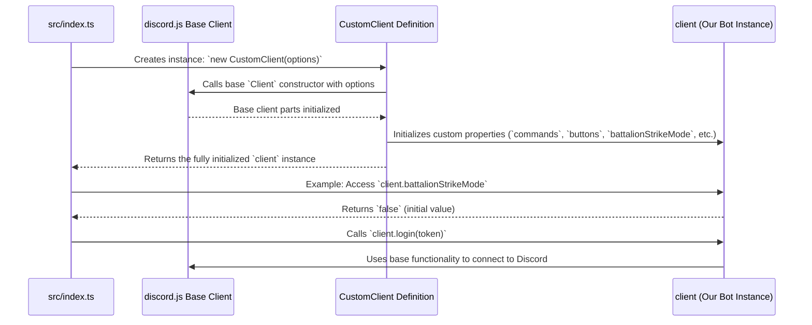

# Chapter 1: Client (CustomClient)

Welcome to the Deployment-bot tutorial! We're excited to guide you through how this bot works, piece by piece. Let's start with the most fundamental part: the bot itself.

Imagine you're building a custom delivery van. You could start with a basic truck chassis (the engine, wheels, frame), but you need to add specific things for *your* delivery needs – shelves for packages, a refrigerated section, a navigation system.

In the world of Discord bots, the standard `discord.js` library gives you that basic truck chassis – it's called the `Client`. It knows how to connect to Discord, see messages, and join servers. But our Deployment-bot needs more! It needs specific "shelves" to hold its commands, "lists" to track who's waiting in line (the queue), and special "settings" for how it operates.

That's where `CustomClient` comes in.

**What Problem Does `CustomClient` Solve?**

The standard Discord.js `Client` is great for basic bot interactions, but it doesn't have built-in places to store *our* bot's specific information.

*   **Use Case Example:** How does the bot know what slash commands (`/deploy`, `/queue`) it has available? How does it remember which button does what? The basic `Client` doesn't track this. We need a dedicated place to store this information so the bot can find and use it quickly.

`CustomClient` solves this by taking the standard `Client` and adding custom storage spaces and properties tailored specifically for the Deployment-bot's features.

**What is `CustomClient`?**

Think of `CustomClient` as a specialized version of the standard Discord.js `Client`. It *is* a `Client` (it can do everything a normal `Client` can), but it has extra features bolted on.

In programming terms, `CustomClient` *extends* the base `Client`. This means it inherits all the standard abilities (connecting to Discord, receiving events like messages) and then adds its own unique properties.

```typescript
// File: src/index.ts (Simplified)

// Import the base Client from discord.js
import { Client, Collection } from "discord.js";
// Import types for our custom items
import Slashcommand from "./classes/Slashcommand.js";
import Button from "./classes/Button.js";
// ... other imports

// Define our custom class inheriting from Client
class CustomClient extends Client {
    // Add custom storage for slash commands
    slashCommands: Collection<String, Slashcommand> = new Collection();
    // Add custom storage for buttons
    buttons: Collection<String, Button> = new Collection();
    // Add custom storage for queue join times
    queueJoinTimes: Collection<String, Date> = new Collection<String, Date>();
    // Add a custom setting (on/off switch)
    battalionStrikeMode: boolean = false;

    // ... other custom properties like cooldowns, modals, etc.
    nextGame: Date;
    interval: NodeJS.Timeout;
}
```

This code defines our `CustomClient`. You can see it uses `extends Client` to inherit standard features. Then, it declares new properties like `slashCommands`, `buttons`, `queueJoinTimes`, and `battalionStrikeMode`.

**Key Added Features:**

1.  **Collections:** Many of the added properties (`slashCommands`, `buttons`, `cooldowns`, etc.) are `Collection`s. A `Collection` is a data structure provided by Discord.js that's like a super-powered JavaScript `Map`. It's optimized for storing bot-related things (like commands, users, etc.) and accessing them quickly using a unique key (like a command name or a user ID).
    *   `slashCommands`, `buttons`, etc.: Hold all the interactive parts of our bot, loaded at startup.
    *   `cooldowns`: Tracks when users last used a command to prevent spam.
    *   `queueJoinTimes`: Remembers when each user joined the deployment queue. This is crucial for [Queue Management](06_queue_management.md).
    *   `battalionStrikeCategories`: Stores data for a specific game mode feature.

2.  **Custom Properties:** Simple variables to hold specific bot states or settings.
    *   `battalionStrikeMode`: A boolean (`true` or `false`) flag to enable/disable a specific mode.
    *   `nextGame`, `interval`: Used internally for timing scheduled events, related to [Queue Management](06_queue_management.md).

**How It's Used: Creating the Bot Instance**

Defining the `CustomClient` class is like creating the blueprint for our custom van. To actually *build* the van, we need to create an *instance* of it.

```typescript
// File: src/index.ts (Continued)

// Import necessary flags
import { IntentsBitField, Partials } from "discord.js";

// Create an instance of our CustomClient
export const client = new CustomClient({
    // Tell Discord what kinds of events our bot needs to receive
    intents: [
        IntentsBitField.Flags.Guilds, // Info about servers the bot is in
        IntentsBitField.Flags.GuildMessages, // Info about messages in servers
        IntentsBitField.Flags.MessageContent, // Access to message content
        IntentsBitField.Flags.GuildMembers, // Info about server members
        IntentsBitField.Flags.GuildVoiceStates // Info about voice channel status
    ],
    // Tell Discord we might need partial data for these items
    partials: [
        Partials.Message,
        Partials.GuildMember,
        // ... other partials
    ]
});

// Now 'client' is our running bot object!
// We can access both standard Client features and our custom ones.
```

This code creates the actual `client` object we'll use throughout the bot's code.
*   `intents`: These are like permissions requests. We tell Discord which types of events our bot cares about (e.g., new messages, members joining). Without the right intents, Discord won't send us that information.
*   `partials`: Sometimes Discord only sends partial information to save resources. This tells `discord.js` to fetch the full information if needed for specific things like messages or members.

Now, anywhere in our code, we can import `client` and use its features:

```typescript
// Example: Somewhere else in the bot's code

import { client } from "./index.js"; // Import our client instance

// Access a custom property
if (client.battalionStrikeMode) {
    console.log("Battalion Strike Mode is ON!");
}

// Access a standard Client property (e.g., the bot's user info)
console.log(`Logged in as ${client.user?.tag}`);

// Access a custom collection (example - might happen during loading)
// Imagine 'myCoolCommand' is an object representing a command
// client.slashCommands.set("coolcommand", myCoolCommand);
```

**Internal Implementation: How it Works Under the Hood**

When the bot starts (`node .` or similar command):

1.  **Code Execution:** The code in `src/index.ts` runs.
2.  **Class Definition:** Node.js reads the `CustomClient` class definition, understanding that it `extends` the base `discord.js` `Client`.
3.  **Instance Creation:** The line `export const client = new CustomClient(...)` is executed.
    *   The `CustomClient` constructor is called.
    *   Internally, it first calls the constructor of the base `discord.js` `Client`, passing the `intents` and `partials` options. This sets up the core Discord connection logic.
    *   Then, it initializes our custom properties: `slashCommands = new Collection()`, `buttons = new Collection()`, `battalionStrikeMode = false`, etc.
4.  **`client` Object Ready:** The `client` object is now created in memory. It contains all methods and properties from the base `Client` *plus* our custom additions.
5.  **Handlers Initialization:** Other parts of the code, like the [Handlers (Loading & Routing)](03_handlers__loading___routing_.md), are initialized. They often receive or import this `client` object to interact with Discord and access the custom collections (e.g., to load commands into `client.commands`).
6.  **Login:** `client.login(config.token)` is called. This uses the base `Client`'s functionality to connect to Discord using the bot token specified in the [Configuration (`config.ts`)](09_configuration___config_ts__.md).
7.  **Ready Event:** Once connected, Discord sends a 'ready' signal. The [Event Handling System](02_event_handling_system.md) catches this, and code like setting the bot's status (`client.user?.setActivity(...)`) runs.

Here's a simplified diagram of the creation process:



**TypeScript Declaration Merging (`src/index.d.ts`)**

You might notice a file `src/index.d.ts` with this content:

```typescript
// File: src/index.d.ts
import { Client } from 'discord.js';

declare module 'discord.js' {
  export interface Client {
    // Tell TypeScript about our added properties
    nextGame: Date;
    interval: NodeJS.Timeout;
    // Note: Other custom properties like collections are implicitly known
    // because they are defined directly in the CustomClient class.
    // This file is often used for properties added *outside* the class definition
    // or to augment existing interfaces.
  }
}
```

This is a bit of TypeScript magic called "declaration merging". Since we added properties (`nextGame`, `interval`) to the `Client` *after* the base `discord.js` library defined it, we need to tell TypeScript about these additions. This file merges our new properties into the existing `Client` definition *for TypeScript's benefit*, allowing it to understand code like `client.nextGame` without giving errors. It doesn't change the JavaScript runtime behavior, only helps with development checks.

**Conclusion**

The `CustomClient` is the heart of the Deployment-bot. By extending the standard `discord.js` `Client`, it provides a central place to manage the bot's connection to Discord *and* store all the custom data and state it needs, like commands, buttons, queue information, and settings. It's the foundation upon which all other features are built.

Now that we have our bot's core (`client`) defined, how does it actually *do* things? How does it respond when someone uses a command or clicks a button? That's where the event system comes in.

Next up: [Chapter 2: Event Handling System](02_event_handling_system.md)
