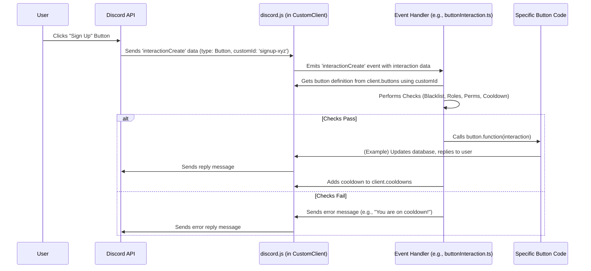

# Chapter 2: Event Handling System

Welcome back! In [Chapter 1: Client (CustomClient)](01_client__customclient_.md), we learned about `CustomClient`, the specialized heart of our Deployment-bot, which stores all its unique information like commands and settings. We have our custom van blueprint ready!

But how does the bot *know* when to do something? What happens when a user actually clicks a button or types a command? How does the bot react? That's where the **Event Handling System** comes in.

**What Problem Does Event Handling Solve?**

Imagine our `CustomClient` bot is sitting quietly in a Discord server. Suddenly, a user clicks a "Join Deployment" button. How does the bot notice this click? And once it notices, how does it know *what specific action* to take for *that specific button*?

The basic `discord.js` library tells our bot *that* something happened (an "event"), but it doesn't automatically know *how* to react. We need a system to listen for specific events and connect them to the right piece of code.

*   **Use Case Example:** When a user clicks the "Sign Up" button on a deployment message, the bot needs to:
    1.  Notice the button click event.
    2.  Identify *which* button was clicked ("Sign Up").
    3.  Check if the user is allowed to click it (e.g., not blacklisted).
    4.  Check if the user needs to wait (cooldown).
    5.  If all checks pass, run the code that actually signs the user up for the deployment.

The Event Handling System organizes this entire process.

**What is the Event Handling System?**

Think of it like setting up notifications on your phone. You tell your phone:
*   "**When** I receive a text message (the event), **then** make a 'ding' sound (the action)."
*   "**When** my calendar reminder goes off (the event), **then** show a pop-up notification (the action)."

Our Event Handling System does the same for the bot:
*   "**When** a user clicks *any* button (`interactionCreate` event), **then** run the code in the `buttonInteraction.ts` file."
*   "**When** the bot successfully connects to Discord (`ready` event), **then** run the code in the `ready.ts` file (like setting its status or loading commands)."
*   "**When** a user sends a message starting with our prefix (`messageCreate` event), **then** run the code in `messageCreate.ts`."

**Key Concepts:**

1.  **Events:** Specific things that happen in Discord that the bot can be aware of. Common examples used by Deployment-bot include:
    *   `ready`: The bot has successfully logged in and is ready to go.
    *   `interactionCreate`: A user interacted with the bot (clicked a button, used a slash command, submitted a form, etc.). This is a very important one!
    *   `messageCreate`: A message was sent in a channel the bot can see.
    *   `voiceStateUpdate`: A user joined/left/muted/etc. in a voice channel.

2.  **Event Files:** For organization, the code that handles each type of event is usually put into its own file inside the `src/events/` directory. Each file exports an object containing:
    *   `name`: The name of the Discord.js event it listens for (e.g., `"interactionCreate"`, `"ready"`).
    *   `once`: A boolean (`true` or `false`). If `true`, the code runs only the *first* time the event happens. If `false`, it runs *every* time. Most events use `false`.
    *   `function`: The actual JavaScript/TypeScript function containing the code to execute when the event occurs. This function receives information about the event (like *which* button was clicked, or *what* message was sent).

3.  **Pre-Checks:** Before running the main logic (like signing someone up), the event handler code often performs important checks:
    *   **Blacklist:** Is the user who triggered the event on a blacklist for this action?
    *   **Permissions:** Does the user have the necessary Discord permissions (e.g., "Manage Channels")?
    *   **Roles:** Does the user have a required role (e.g., "Helldiver")?
    *   **Cooldowns:** Did the user perform this action too recently?

**How It Works: Reacting to a Button Click**

Let's revisit our use case: a user clicks the "Sign Up" button.

1.  **Discord Sends Event:** Discord detects the button click and sends an `interactionCreate` event notification to our bot.
2.  **`discord.js` Emits Event:** The `discord.js` library (inside our `CustomClient`) receives this notification and "emits" an `interactionCreate` event within our bot's code.
3.  **Event Listener Catches Event:** Our Event Handling System has previously set up a listener (we'll see how in the next chapter). This listener specifically waits for the `interactionCreate` event. When it happens, it calls the `function` defined in the relevant event file. Since many interactions (buttons, commands, modals, menus) trigger `interactionCreate`, we have multiple files listening for it, but they check the *type* of interaction first. For a button click, the code in `src/events/client/buttonInteraction.ts` will proceed.
4.  **Identify the Specific Button:** The code inside `buttonInteraction.ts` gets information about the click, including the button's unique `customId`. It uses this ID to look up the specific button's details (like its required permissions or cooldown) stored in `client.buttons` (remember our `CustomClient` from Chapter 1?).

    ```typescript
    // File: src/events/client/buttonInteraction.ts (Simplified)

    import { client } from "../../index.js"; // Import our bot instance
    import { ButtonInteraction } from "discord.js";
    // ... other imports for checks

    export default {
        name: "interactionCreate", // Listen for any interaction
        once: false,
        function: async function (interaction: ButtonInteraction) {
            // 1. Is it actually a button interaction? If not, stop.
            if (!interaction.isButton()) return;

            // 2. Find the button's definition based on its ID
            // Checks exact ID (e.g., "signup-123") or base ID (e.g., "signup")
            const button = client.buttons.get(interaction.customId)
                || client.buttons.get(interaction.customId.split("-")[0]);
            if (!button) return; // If we don't know this button, stop.

            // ... (Checks happen here) ...

            // If all checks pass, run the button's specific code
            try {
                button.function({ interaction }); // Execute the code defined for this button
            } catch (e) {
                // Handle errors...
            }

            // ... (Apply cooldown if needed) ...
        },
    };
    ```
    *   This code listens for `interactionCreate`.
    *   It first checks `if (!interaction.isButton())` to make sure it's a button click.
    *   It then uses `client.buttons.get(...)` to retrieve the predefined button object (loaded at startup) using the `interaction.customId`.
    *   If found, it proceeds to checks.

5.  **Perform Pre-Checks:** The code then runs checks using helper functions:

    ```typescript
    // File: src/events/client/buttonInteraction.ts (Simplified Checks)

    // ... inside the function, after finding the 'button' object ...

    // Check if user's role is blacklisted for this button
    if(await checkBlacklist(interaction, button.blacklistedRoles)) return;
    // Check if user has roles required by this button
    if(!(await hasRequiredRoles(interaction, button.requiredRoles))) return;
    // Check if user has Discord permissions required by this button
    if(!(await hasRequiredPermissions(interaction, button.permissions))) return;
    // Check if user is on cooldown for this button
    if(await checkCooldowns(interaction, client.cooldowns.get(`${interaction.user.id}-${button.id}`))) return;

    // ... If none of the checks 'return', proceed to execute button.function ...
    ```
    *   Each `if` statement calls a specific checking function (like `checkBlacklist`). These functions typically return `true` if the check *fails* (e.g., the user *is* blacklisted), causing the handler to `return` (stop processing this event).
    *   `client.cooldowns.get(...)` retrieves any active cooldown for this specific user and button from the `CustomClient`.

6.  **Execute Button Logic:** If all checks pass, the line `button.function({ interaction });` is executed. This calls the *actual* code associated with that specific button (e.g., the code to add the user to the `Signups` database table).
7.  **Apply Cooldown:** Finally, if the button has a cooldown configured, a new cooldown entry is added to `client.cooldowns`.

    ```typescript
    // File: src/events/client/buttonInteraction.ts (Simplified Cooldown)

    // ... after button.function has executed ...

    if (button.cooldown) {
        // Add a new cooldown record for this user and button ID
        client.cooldowns.set(
            `${interaction.user.id}-${button.id}`,
            new Cooldown(`${interaction.user.id}-${button.id}`, button.cooldown)
        );
    }
    ```

This same pattern (Event -> Listener -> Identify Specific Item -> Checks -> Execute -> Post-Actions) applies to slash commands, context menus, select menus, and modals as well, often all using the `interactionCreate` event but checking the interaction *type* first.

**Internal Implementation: How Events Get Hooked Up**

How does the bot know which file corresponds to which event? This is handled during the bot's startup process by an "Event Handler".

1.  **Loading:** When the bot starts, code in `src/handlers/eventHandler.ts` runs.
2.  **Reading Files:** This handler reads all the `.js` (or `.ts`) files within the `src/events/client/` and `src/events/guild/` directories.
3.  **Registering Listeners:** For each file it finds, it looks at the exported `name` (e.g., `"interactionCreate"`) and `function`. It then tells the `discord.js` client (`client`): "Hey, whenever you emit an event called `[name]`, please execute `[function]`". It uses `client.on(eventName, function)` for recurring events or `client.once(eventName, function)` for one-time events.

```typescript
// File: src/handlers/eventHandler.ts (Simplified)
import fs from "fs";
import path from "path";
import { client } from "../index.js"; // Our bot instance

export default {
    function: async function () {
        // Define directories where event files live
        const eventDirs = ["client", "guild"];

        for (const dir of eventDirs) {
            const dirPath = path.resolve(__dirname, `../events/${dir}/`);
            const eventFiles = fs.readdirSync(dirPath).filter(file => file.endsWith(".js")); // Find JS files

            for (const file of eventFiles) {
                // Import the event file's content
                const event = (await import(`${dirPath}/${file}`)).default;
                const eventName = event.name; // Get the event name (e.g., "interactionCreate")

                // Tell the client to listen for this event and run the function
                if (event.once) {
                    client.once(eventName, event.function.bind(null));
                } else {
                    client.on(eventName, event.function.bind(null)); // Most common case
                }
            }
        }
    }
};
```
*   This code loops through specified directories (`client`, `guild`).
*   It reads each file (e.g., `buttonInteraction.js`).
*   It imports the file to get the `event` object defined within it.
*   Crucially, `client.on(eventName, event.function.bind(null));` tells `discord.js`: "When you see `eventName` happen, call `event.function`."

Here's a simplified flow:



We'll learn more about how these handlers are loaded in the next chapter.

**Conclusion**

The Event Handling System is the bot's nervous system. It listens for signals (events) from Discord and triggers the correct response (the code in the event files). By organizing code into files based on the event they handle (like `interactionCreate`, `ready`, `messageCreate`), and by including standard checks for permissions, roles, blacklists, and cooldowns, it provides a structured way for the bot to react dynamically to user actions and its own status changes.

Now that we know *how* the bot reacts to events, how does it load all these event files, commands, buttons, etc., when it starts?

Next up: [Chapter 3: Handlers (Loading & Routing)](03_handlers__loading___routing_.md)
