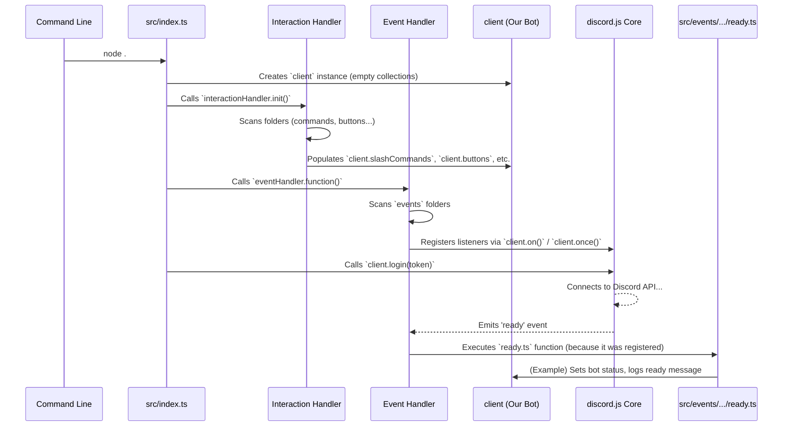

# Chapter 3: Handlers (Loading & Routing)

Welcome back! In [Chapter 2: Event Handling System](02_event_handling_system.md), we learned how the bot listens for specific events (like button clicks or messages) and runs the right code using event files stored in the `src/events/` directory. We saw how an `interactionCreate` event could trigger the code for a specific button.

But wait... how did the bot *know* about that button file in the first place? How does it find all the different command files (`/deploy`, `/queue`), button files ("Sign Up", "Leave Queue"), and event files (`ready.ts`, `interactionCreate.ts`) when it starts up?

That's where **Handlers** come in!

**What Problem Do Handlers Solve?**

Imagine you have a big box of LEGOs, with pieces for building spaceships, castles, and cars all mixed together. Before you can build anything specific, you need to sort the pieces, right? You'd put all the spaceship wings together, all the castle walls together, and all the car wheels together.

Our bot's code is similar. We have different files for different features:
*   Files defining slash commands (`src/slashCommands/deploy.ts`)
*   Files defining buttons (`src/buttons/signupButton.ts`)
*   Files defining event responses (`src/events/client/ready.ts`)

When the bot starts, it needs a way to automatically find all these "pieces," understand what they do, and organize them so they're ready to be used. It can't magically know that `deploy.ts` contains the code for the `/deploy` command unless something tells it.

*   **Use Case Example:** When you run `node .` to start the bot, it needs to:
    1.  Find the file defining the `/deploy` slash command.
    2.  Load the command's details (name, description, code to run).
    3.  Store this command information somewhere easy to find later (like in `client.slashCommands` from [Chapter 1: Client (CustomClient)](01_client__customclient_.md)).
    4.  Find the file that should run when the `ready` event happens.
    5.  Tell `discord.js` "Hey, when you're ready, run the code from *this* specific file."

Handlers automate this entire setup process.

**What are Handlers? The Librarian and the Receptionist**

Think of the handlers as the bot's setup crew that works behind the scenes when the bot starts:

1.  **Interaction Handler (`interactionHandler.ts`): The Librarian**
    *   This handler's job is to find all the files related to *interactions* (things users can directly trigger, like commands, buttons, menus, modals).
    *   It scans specific folders like `src/slashCommands/`, `src/buttons/`, etc.
    *   For each file it finds, it reads the information (like the command name or button ID) and the function to execute.
    *   It then "catalogs" this information by storing it in the appropriate `Collection` on our `CustomClient` (e.g., putting the `/deploy` command object into `client.slashCommands`, the "Sign Up" button object into `client.buttons`). Now the bot knows these interactions exist and where to find their code.

2.  **Event Handler (`eventHandler.ts`): The Receptionist**
    *   This handler's job is to set up the listeners for Discord *events* (things that happen in Discord, like the bot connecting, a message being sent, or a user joining voice).
    *   It scans the `src/events/` folders.
    *   For each file it finds (like `ready.ts` or `buttonInteraction.ts`), it reads which event it's for (`name`) and what code to run (`function`).
    *   It then tells the core `discord.js` client: "When you see *this event* happen, call *this function*." It's like telling a receptionist, "When the 'ready' call comes in, forward it to extension 101 (the `ready.ts` function)."

3.  **Other Handlers (like `databaseHandler.ts`):**
    *   There might be other handlers for specific setup tasks. For example, `databaseHandler.ts` connects the bot to its database using the settings from [Configuration (`config.ts`)](09_configuration___config_ts__.md) and makes sure the database tables (defined using [Database Entities (TypeORM)](07_database_entities__typeorm_.md)) are ready.

These handlers typically run once when the bot starts (`index.ts` calls them).

**How It Works: Loading Interactions (The Librarian)**

The `interactionHandler.ts` is responsible for loading commands, buttons, modals, etc. Let's look at a simplified version of how it might load buttons:

```typescript
// File: src/handlers/interactionHandler.ts (Simplified)
import fs from "fs"; // Node.js module for file system operations
import path from "path"; // Node.js module for working with file paths
import { client } from "../index.js"; // Our CustomClient instance
import { fileURLToPath } from 'url'; // Helper for file paths
import { convertURLs } from "../utils/windowsUrlConvertor.js"; // Path helper

// ... (Helper to get current directory path) ...
const __dirname = /* ... gets current directory ... */;

// Function to register interactions from a directory
async function register(dirType: string) { // e.g., dirType = "buttons"
    const dirPath = path.resolve(__dirname, `../${dirType}/`); // Path to src/buttons/
    const files = fs.readdirSync(dirPath); // Get list of files in src/buttons/

    for (const file of files) {
        if (file.endsWith(".js") || file.endsWith(".ts")) { // Only process code files
            // Construct the full path to the file (OS-agnostic)
            const fileToImport = process.platform === "win32" ? `${convertURLs(dirPath)}/${file}` : `${dirPath}/${file}`;
            // Import the file's default export
            const interaction = (await import(fileToImport)).default;

            // Make sure we imported something valid
            if (!interaction || !interaction.id) continue;

            // Store the interaction in the client's collection
            // e.g., client["buttons"].set(interaction.id, interaction)
            client[dirType].set(interaction.id, interaction);
            console.log(`Loaded button: ${interaction.id}`);
        }
        // (Code also handles subdirectories, omitted for simplicity)
    }
}

export default {
    init: async function () {
        // List of interaction types/directories to load
        const interactionTypes = ["slashCommands", "buttons", /* ... others ... */];
        for (const type of interactionTypes) {
            await register(type); // Load interactions for each type
        }
    }
};
```

*   **`register(dirType)` function:**
    *   Takes the type of interaction (like `"buttons"`) as input.
    *   Calculates the full path to the corresponding directory (e.g., `src/buttons/`).
    *   Uses `fs.readdirSync` to get a list of all files inside that directory.
    *   Loops through each `file`.
    *   Checks if it's a JavaScript or TypeScript file (`.js` or `.ts`).
    *   Uses `await import(...)` to dynamically load the code from the file. We expect each file to `export default` an object representing the interaction (like a button definition).
    *   It retrieves the unique `id` from the imported `interaction` object.
    *   Crucially, `client[dirType].set(interaction.id, interaction)` stores the loaded interaction object into the correct collection on our `CustomClient`. For buttons, `dirType` is "buttons", so this is equivalent to `client.buttons.set(button.id, button)`.
*   **`init` function:**
    *   This is the main function exported by the handler.
    *   It defines a list of all interaction types it needs to load.
    *   It loops through this list and calls `register()` for each type, ensuring all commands, buttons, etc., are loaded.

When this handler runs at startup, it systematically finds, loads, and catalogs every interaction file, populating the collections on our `client` object.

**How It Works: Loading Events (The Receptionist)**

The `eventHandler.ts` sets up the listeners described in Chapter 2. Here's a simplified look:

```typescript
// File: src/handlers/eventHandler.ts (Simplified)
import fs from "fs";
import path from "path";
import { client } from "../index.js"; // Our CustomClient instance
import { fileURLToPath } from 'url';
import { convertURLs } from "../utils/windowsUrlConvertor.js";

// ... (Helper to get current directory path) ...
const __dirname = /* ... gets current directory ... */;

export default {
    function: async function () {
        // Directories containing event files
        const eventDirs = ["client", "guild"];

        for (const dir of eventDirs) { // Loop through 'client' and 'guild' folders
            const dirPath = path.resolve(__dirname, `../events/${dir}/`);
            const eventFiles = fs.readdirSync(dirPath).filter(file => file.endsWith(".js") || file.endsWith(".ts"));

            for (const file of eventFiles) {
                // Construct the full path and import the event file
                const fileToImport = process.platform === "win32" ? `${convertURLs(dirPath)}/${file}` : `${dirPath}/${file}`;
                const event = (await import(fileToImport)).default;

                // Get the event name (e.g., "interactionCreate", "ready")
                const eventName = event.name;
                // Get the function to run when the event occurs
                const eventFunction = event.function;

                // Register the listener with discord.js
                // If event.once is true, use client.once, otherwise use client.on
                if (event.once) {
                    client.once(eventName, eventFunction.bind(null));
                } else {
                    // Most common: run every time the event happens
                    client.on(eventName, eventFunction.bind(null));
                }
                console.log(`Registered event listener: ${eventName}`);
            }
        }
    }
};
```

*   **`function`:**
    *   Defines the directories where event files are located (`src/events/client/`, `src/events/guild/`).
    *   Loops through each directory and then through each `.js`/`.ts` file within it.
    *   Imports the event file using `await import(...)`. We expect each file to `export default` an object containing at least `name` (the event name) and `function` (the code to execute).
    *   It retrieves the `eventName` and `eventFunction` from the imported object.
    *   The key step is `client.on(eventName, eventFunction.bind(null))` (or `client.once` if `event.once` is true). This tells the `discord.js` client instance: "Whenever the event named `eventName` occurs, execute the `eventFunction`." The `.bind(null)` part is just a technical detail to ensure the function runs correctly.

When this handler finishes, `discord.js` knows exactly which function to call for every event the bot needs to listen to.

**Internal Implementation: The Startup Sequence**

So, how do these handlers actually get called? They are typically invoked very early in the bot's main startup file (`src/index.ts`).

1.  **Start:** You run `node .` or similar.
2.  **`index.ts` Begins:** The code in `src/index.ts` starts executing.
3.  **Create `CustomClient`:** The `client` object (our [CustomClient](01_client__customclient_.md)) is created, but its collections (`commands`, `buttons`, etc.) are still empty.
4.  **Run Database Handler:** `databaseHandler.ts` is likely called to connect to the database.
5.  **Run Interaction Handler:** The `interactionHandler.init()` function is called.
    *   It scans `src/commands/`, `src/buttons/`, etc.
    *   It imports each file.
    *   It populates `client.slashCommands`, `client.buttons`, etc., with the loaded interactions. The "Librarian" finishes cataloging.
6.  **Run Event Handler:** The `eventHandler.function()` is called.
    *   It scans `src/events/client/`, `src/events/guild/`.
    *   It imports each file.
    *   It calls `client.on(...)` or `client.once(...)` for each event, registering the listeners. The "Receptionist" is ready to direct calls.
7.  **Login:** `client.login(config.token)` is called. The bot attempts to connect to Discord.
8.  **Ready Event:** Once successfully connected, Discord sends the `ready` signal.
9.  **Event System Reacts:** Because the Event Handler already registered a listener using `client.once('ready', ...)` (pointing to the function in `src/events/client/ready.ts`), `discord.js` now calls that specific function. The bot is officially up and running!

Here's a diagram of the simplified startup flow:



This automated loading and routing performed by the handlers is crucial. It means that to add a new command or button, you just need to create a new file in the correct directory following the expected structure. The handlers will automatically find it and integrate it into the bot when it restarts – no need to manually edit `index.ts` every time!

**Conclusion**

Handlers are the unsung heroes of the bot's startup process. The **Interaction Handler** acts like a librarian, finding and cataloging all the command, button, and other interaction files into the `CustomClient`'s collections. The **Event Handler** acts like a receptionist, setting up the connections so that when Discord sends an event signal, the correct function from our event files is called. Together, they ensure that when the bot finishes starting up, it's fully aware of all its capabilities and ready to respond to users and events.

Now that we know how interactions are loaded, what exactly *is* inside those command and button files? How are they structured? That's where our next topic comes in.

Next up: [Chapter 4: Interaction Abstraction Classes](04_interaction_abstraction_classes.md)
