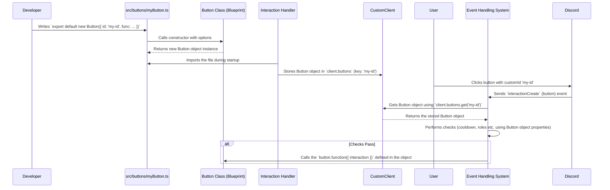

# Chapter 4: Interaction Abstraction Classes

Welcome back! In [Chapter 3: Handlers (Loading & Routing)](03_handlers__loading___routing_.md), we saw how the bot automatically finds and loads all its different parts – commands, buttons, event listeners – when it starts up. The "Interaction Handler" acts like a librarian, cataloging every `/deploy` command or "Sign Up" button it finds in the project files.

But how does the handler *know* what information to expect inside those files? When it loads `src/buttons/deleteDeployment.ts`, how does it know that file should contain an ID, maybe some permissions, and the actual code to run when the button is clicked? If every developer defined their buttons differently, it would be chaos!

**What Problem Do Interaction Abstraction Classes Solve?**

Imagine you're filling out different forms online: one for signing up for a newsletter, another for ordering a pizza, and a third for reporting a bug. Even though the forms are for different purposes, they often share common elements: text fields, checkboxes, and a submit button. More importantly, the website *expects* certain information in a specific format for each form type.

Our bot interactions are similar. We have different ways users can interact:
*   Typing a slash command (like `/deploy`)
*   Clicking a button (like "Join Queue")
*   Submitting a pop-up form (a Modal)
*   Choosing from a dropdown (a Select Menu)
*   Right-clicking a user or message (a Context Menu)

We need a standard way to define the structure and behavior for each of these interaction types.

*   **Use Case Example:** Let's say we want to create a new "Leave Deployment" button. We need a consistent way to specify:
    1.  Its unique identifier (e.g., `customId: "leaveDeployment"`).
    2.  Maybe a cooldown period to prevent spam clicking.
    3.  Any specific roles or permissions required (or blocked).
    4.  Crucially, the exact piece of code (the function) that should run when a user clicks *this specific button* to remove them from the deployment.

Without a standard structure, defining this button might look completely different from defining the "Sign Up" button, making the code hard to understand and maintain.

**What are Interaction Abstraction Classes? The Blueprints**

This is where **Interaction Abstraction Classes** come in. Think of them as **blueprints** or **templates** for defining different kinds of interactions. Just like a blueprint for a house specifies where the walls, doors, and windows go, these classes specify what properties each interaction type needs.

The `Deployment-bot` project defines several of these blueprint classes, typically found in the `src/classes/` directory:

*   `Button`: For defining clickable buttons.
*   `SlashCommand`: For defining `/` commands.
*   `Modal`: For defining pop-up forms.
*   `SelectMenu`: For defining dropdown menus.
*   `ContextMenu`: For defining right-click menu actions on users or messages.
*   *(And a basic `Command` class for older prefix-based commands)*

Each class acts as a template, ensuring that every time we create a new interaction of that type, we define it using the same structure.

**The Blueprint Structure: Common Properties and the `func`**

These classes enforce a consistent structure. Most of them share common properties:

*   **`id` or `name`:** A unique string to identify this specific interaction (e.g., `"deleteDeployment"`, `"deploy"`). For buttons, menus, and modals, this is often used as the `customId`. For slash commands, it's the command name.
*   **`cooldown` (Optional):** A number representing how many seconds a user must wait before using this interaction again.
*   **`permissions` (Optional):** An array of Discord permissions (like `ManageMessages`) the user needs to have in the channel to use the interaction.
*   **`requiredRoles` (Optional):** An array defining specific server roles the user must have (or one of, depending on configuration) to use the interaction.
*   **`blacklistedRoles` (Optional):** An array defining specific server roles that *cannot* use the interaction.

And the most important piece:

*   **`func`:** This property holds the **actual JavaScript/TypeScript function** that contains the logic to be executed when a user triggers this interaction. This function typically receives an `interaction` object as input, which contains all the details about the event (who clicked, where they clicked, any values they submitted, etc.).

**How It's Used: Creating a New Button**

Let's see how we'd use the `Button` blueprint to define a button. Imagine we're creating the `deleteDeployment` button.

1.  **Import the Blueprint:** First, we import the `Button` class blueprint.

    ```typescript
    // File: src/buttons/deleteDeployment.ts (Simplified)
    import Button from "../classes/Button.js"; // Import the blueprint
    import { buildEmbed } from "../utils/embedBuilders/configBuilders.js";
    import Deployment from "../tables/Deployment.js"; // For database logic
    import config from "../config.js"; // For configuration values
    ```
    This line brings in the `Button` class definition from `src/classes/Button.ts`.

2.  **Create an Instance (Fill out the Blueprint):** We then create a `new Button` and provide the necessary properties defined by the blueprint.

    ```typescript
    // File: src/buttons/deleteDeployment.ts (Continued)

    export default new Button({
        // --- Properties defined by the Button class ---
        id: "deleteDeployment", // Unique identifier for this button
        cooldown: config.buttonCooldown, // Cooldown from config
        permissions: [], // No specific Discord permissions needed
        requiredRoles: [], // No specific roles needed
        blacklistedRoles: [...config.blacklistedRoles], // Users with these roles cannot click

        // --- The core logic ---
        func: async function ({ interaction }) {
            // This code runs when the button is clicked!
            console.log(`User ${interaction.user.tag} clicked the delete button!`);

            // Simplified logic: Find and delete the deployment in the database
            const deployment = await Deployment.findOne({ /* ... find based on interaction ... */ });
            if (!deployment) {
                // Reply with an error if not found
                return await interaction.reply({ content: "Deployment not found.", ephemeral: true });
            }
            // (Add checks: is it the user who created it?)
            // await deployment.remove();

            // Reply with success
            await interaction.reply({ content: "Deployment deleted (pretend).", ephemeral: true });

            // Maybe delete the original message containing the button
            // await interaction.message.delete();
        }
    });
    ```
    *   `export default new Button({...})`: This creates a new button object based on the `Button` blueprint and makes it available for the `Interaction Handler` to find.
    *   `id`, `cooldown`, `permissions`, `requiredRoles`, `blacklistedRoles`: These are the standard properties we fill in according to the blueprint.
    *   `func: async function ({ interaction }) { ... }`: This is where we define the specific actions for *this* button. The `interaction` object gives us context about the click event.

**Connecting the Dots:**

*   **Loading (Chapter 3):** The `Interaction Handler` finds this `src/buttons/deleteDeployment.ts` file during startup. It sees `export default new Button(...)`, executes it, and stores the resulting `Button` object in the `client.buttons` collection (from [Chapter 1: Client (CustomClient)](01_client__customclient_.md)), keyed by its `id` ("deleteDeployment").
*   **Reacting (Chapter 2):** When a user clicks a button with the `customId` "deleteDeployment", the `interactionCreate` event fires. The code in `src/events/client/buttonInteraction.ts` (part of the [Event Handling System](02_event_handling_system.md)) retrieves our specific `Button` object using `client.buttons.get("deleteDeployment")`. After performing checks (like cooldowns and roles based on the properties we defined: `cooldown`, `blacklistedRoles`), it executes the `func` we defined above, passing in the `interaction` details.

**Internal Implementation: Defining the Blueprint (`Button.ts`)**

How is the `Button` blueprint itself defined? Let's look at a simplified version of `src/classes/Button.ts`:

```typescript
// File: src/classes/Button.ts (Simplified)
import { ButtonInteraction, PermissionsString } from "discord.js";
// Import type definition for roles (shared with Slashcommand)
import { requiredRolesType } from "./Slashcommand.js";

// Define the structure of the object passed to the constructor
interface ButtonOptions {
    id: string;
    cooldown?: number; // Optional property
    permissions?: PermissionsString[]; // Optional property
    requiredRoles?: requiredRolesType; // Optional property
    blacklistedRoles?: string[]; // Optional property
    func: (params: { interaction: ButtonInteraction }) => void; // Function type
}

// Define the Button class
export default class Button {
    // --- Public properties that instances will have ---
    public id: string;
    public cooldown?: number;
    public permissions?: PermissionsString[];
    public requiredRoles?: requiredRolesType;
    public blacklistedRoles?: string[];
    public function: (params: { interaction: ButtonInteraction }) => void;

    // --- The Constructor: Runs when `new Button(...)` is called ---
    public constructor(options: ButtonOptions) {
        // Assign the provided options to the object's properties
        this.id = options.id;
        this.cooldown = options.cooldown;
        this.permissions = options.permissions;
        this.requiredRoles = options.requiredRoles;
        this.blacklistedRoles = options.blacklistedRoles;
        this.function = options.func; // Note: property name is 'function'
    }
}
```

*   **`interface ButtonOptions { ... }`:** This TypeScript interface defines the shape of the configuration object we pass when creating a `new Button`. It specifies the required (`id`, `func`) and optional (`cooldown`, `permissions`, etc.) properties and their types.
*   **`export default class Button { ... }`:** This defines the `Button` blueprint.
*   **`public id: string; ...`:** These lines declare the properties that every `Button` object will have.
*   **`public constructor(options: ButtonOptions) { ... }`:** The constructor is a special function called automatically when you use `new Button(...)`. It takes the `options` object (which must match the `ButtonOptions` structure) and assigns its values to the corresponding properties of the newly created button object (`this.id = options.id`, etc.).

The other classes (`SlashCommand.ts`, `Modal.ts`, etc.) work very similarly. They define their own specific properties (e.g., `SlashCommand` has `name` and `options` for command arguments, `Modal` only needs `id` and `func` as it's triggered differently) and a constructor to set them up.

**Visualizing the Flow**

Here's how creating and using a button with its abstraction class works:



**Conclusion**

Interaction Abstraction Classes (`Button`, `SlashCommand`, `Modal`, etc.) are essential for organizing the `Deployment-bot`. They act as **blueprints**, ensuring that every command, button, or other interaction is defined with a consistent structure.

Key takeaways:
*   They define standard properties like `id`/`name`, `cooldown`, `permissions`, and `roles`.
*   They contain a `func` property holding the specific code to execute for that interaction.
*   Using these classes makes adding new interactions predictable and keeps the codebase cleaner.
*   The [Interaction Handler](03_handlers__loading___routing_.md) loads objects created from these blueprints, and the [Event Handling System](02_event_handling_system.md) uses them to route interactions to the correct `func`.

Now that we understand how interactions are defined, let's dive deeper into one of the core functionalities of this bot: managing the actual deployments.

Next up: [Chapter 5: Deployment Management](05_deployment_management.md)

