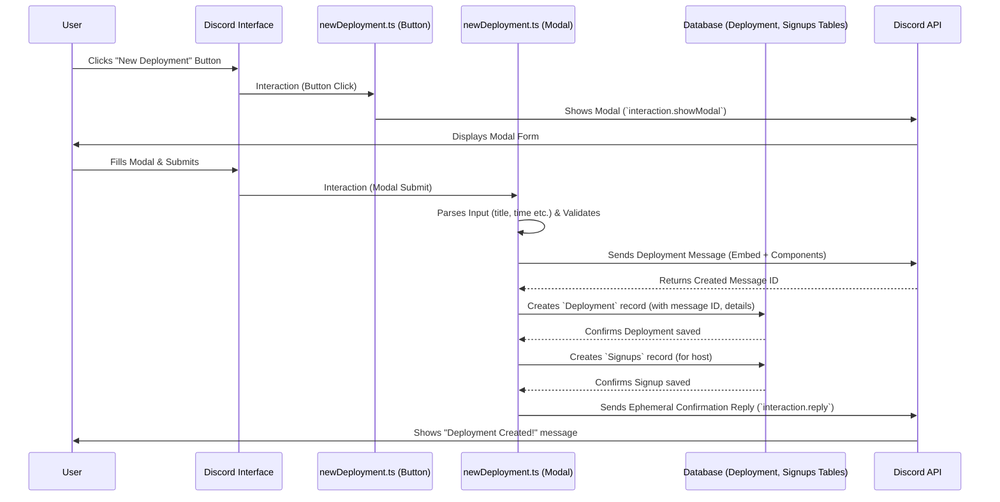

# Chapter 5: Deployment Management

Welcome back! In [Chapter 4: Interaction Abstraction Classes](04_interaction_abstraction_classes.md), we learned about the blueprints (`Button`, `SlashCommand`, etc.) that help us define *how* users can interact with the bot in a structured way. We saw how a button like "Delete Deployment" is created using the `Button` blueprint.

Now, let's talk about the core *purpose* behind many of those interactions: managing **Deployments**. This is the heart and soul of what the `Deployment-bot` does!

**What Problem Does Deployment Management Solve?**

Imagine trying to organize a game session with friends just using chat messages. It gets messy fast!
*   Who is actually playing?
*   Who is just a maybe?
*   When exactly does it start?
*   Did everyone get the reminder?
*   What are the mission details again?

Keeping track of all this manually is chaotic and prone to errors. People forget, details get lost in chat, and it's hard to get a clear picture of upcoming games.

*   **Use Case Example:** You want to schedule a Helldivers 2 mission for Saturday at 7 PM. You need to:
    1.  Announce the mission (title, difficulty, description).
    2.  Set the start time.
    3.  Let people sign up for specific roles (or as backups).
    4.  See who has signed up at a glance.
    5.  Send out a reminder shortly before it starts.
    6.  Maybe edit the details if something changes.
    7.  Eventually, clean up the old announcement after the game is over.

Deployment Management provides a dedicated system within the bot to handle all these steps smoothly and automatically.

**What is a Deployment? The Game Session Event**

Think of a **Deployment** as a scheduled event specifically for a game session supported by the bot. It's like creating an event on your Google Calendar or a meeting invite in Outlook, but tailored for gaming.

Each Deployment holds key information:

*   **`title`**: The name of the game session or mission (e.g., "Operation: Terminid Tuesday").
*   **`description`**: Details about the session (e.g., "Let's clear some bug planets! Bring flamethrowers.").
*   **`difficulty`**: The planned difficulty level.
*   **`startTime`**: The exact date and time the session is scheduled to begin.
*   **`endTime`**: The calculated time the session is expected to end (usually `startTime` + duration).
*   **`host` (or `user`)**: The Discord user ID of the person who created the deployment.
*   **Participants**: Who is joining? This is tracked in two ways:
    *   **`Signups`**: The primary players who have claimed a spot (often with a specific role).
    *   **`Backups`**: Players who are on standby if a primary player can't make it.
*   **`message` / `channel`**: The ID of the Discord message and channel where the deployment details are displayed.
*   **Status Flags**: Internal trackers like `started` (has it begun?), `deleted` (is it finished/cancelled?), `noticeSent` (has the reminder been sent?).

This structured information is stored in the bot's database, allowing it and the users to manage the event effectively.

**How Users Interact with Deployments**

Users interact with deployments through various commands and buttons, often using the [Interaction Abstraction Classes](04_interaction_abstraction_classes.md) we saw in the previous chapter.

1.  **Creating a Deployment:**
    *   Typically starts with a user (who has the required role, e.g., "Host") clicking a button like "New Deployment" (defined in `src/buttons/newDeployment.ts`).
    *   This button often triggers a Modal (pop-up form) defined in `src/modals/newDeployment.ts`.
    *   The user fills in the title, description, difficulty, and start time in the modal.
    *   When submitted, the modal's `func` processes the input, validates it (especially the time), and asks the user to select a channel.
    *   Finally, it creates the deployment record in the database and posts a message in the chosen channel with an embed showing the details and buttons/menus for others to interact with.

    ```typescript
    // File: src/modals/newDeployment.ts (Highly Simplified 'func')
    import Deployment from "../tables/Deployment.js";
    import Signups from "../tables/Signups.js";
    import { buildDeploymentEmbed } from "../utils/embedBuilders/signupEmbedBuilder.js";
    // ... other imports

    export default new Modal({
        id: "newDeployment",
        func: async function({ interaction }) {
            // 1. Get data from the submitted modal fields
            const title = interaction.fields.getTextInputValue("title");
            const difficulty = interaction.fields.getTextInputValue("difficulty");
            const description = interaction.fields.getTextInputValue("description");
            const startTimeString = interaction.fields.getTextInputValue("startTime");

            // 2. Validate and parse the start time (simplified)
            const startDate = await getStartTime(startTimeString, interaction); // Utility function
            if (!startDate) { /* handle error */ return; }

            // 3. Ask user to select a channel (via Select Menu - simplified)
            // const channelId = await askUserForChannel(interaction);
            const channelId = "123456789012345678"; // Example channel ID

            // 4. Create the message with embed and interactive components
            const embed = /* ... build the initial embed ... */;
            const components = /* ... build buttons and signup menu ... */;
            const channel = await interaction.client.channels.fetch(channelId);
            const message = await channel.send({ embeds: [embed], components });

            // 5. Save the Deployment to the database
            const deployment = await Deployment.create({
                channel: channelId,
                message: message.id,
                user: interaction.user.id,
                title: title,
                difficulty: difficulty,
                description: description,
                startTime: startDate.getTime(),
                endTime: startDate.getTime() + 7200000, // Add 2 hours (example)
                // ... other initial flags (started: false, etc.)
            }).save();

            // 6. Sign up the host automatically
            await Signups.insert({
                deploymentId: deployment.id,
                userId: interaction.user.id,
                role: "Offense" // Default role for host
            });

            // 7. Confirm to the user (ephemeral reply)
            await interaction.reply({ content: "Deployment created!", ephemeral: true });
        }
    });
    ```
    This simplified code shows the main steps: get input, validate, create the Discord message, save the deployment data to the `Deployment` table (using [Database Entities (TypeORM)](07_database_entities__typeorm_.md)), add the host to the `Signups` table, and confirm.

2.  **Signing Up / Changing Role:**
    *   Users click the "Select a role to sign up..." dropdown menu attached to the deployment message. This menu is defined in `src/selectMenus/signup.ts`.
    *   When a user selects an option (a specific role or "Backup"), the `func` in `signup.ts` runs.
    *   It checks rules (Is the deployment full? Are they the host trying to be a backup?).
    *   It updates the `Signups` or `Backups` tables in the database accordingly (adding, removing, or moving the user).
    *   It then updates the original deployment message embed to reflect the new list of participants using a helper like `buildDeploymentEmbed`.

    ```typescript
    // File: src/selectMenus/signup.ts (Simplified 'func')
    import Deployment from "../tables/Deployment.js";
    import Signups from "../tables/Signups.js";
    import Backups from "../tables/Backups.js";
    import { buildDeploymentEmbed } from "../utils/embedBuilders/signupEmbedBuilder.js";
    // ... other imports

    export default new SelectMenu({
        id: "signup",
        func: async function({ interaction }) {
            const selectedRole = interaction.values[0]; // e.g., "Offense", "Support", "Backup"
            const userId = interaction.user.id;

            // 1. Find the deployment this message belongs to
            const deployment = await Deployment.findOne({ where: { message: interaction.message.id } });
            if (!deployment) { /* handle error */ return; }

            // 2. Check existing signup/backup status for this user
            const existingSignup = await Signups.findOne(/* ... */);
            const existingBackup = await Backups.findOne(/* ... */);

            // 3. Apply game rules and update database
            //    (Simplified logic - handles adding, removing, switching, capacity checks)
            if (selectedRole === "Backup") {
                // Remove from Signups if exists, add to Backups if not full
            } else {
                // Remove from Backups if exists, add/update Signups if not full
            }
            // ... database operations (insert, update, remove) ...

            // 4. Update the embed in the original message
            const updatedEmbed = await buildDeploymentEmbed(deployment, interaction.guild);
            await interaction.update({ embeds: [updatedEmbed] }); // Update the message instantly
        }
    });
    ```

3.  **Leaving a Deployment:**
    *   Users click the "Leave" button (defined in `src/buttons/leaveDeployment.ts`).
    *   The `func` checks if the user is actually signed up (either as primary or backup).
    *   It removes the corresponding entry from the `Signups` or `Backups` table.
    *   It updates the deployment message embed.

4.  **Editing a Deployment:**
    *   Only the host can edit, and usually only *before* the deployment is about to start (e.g., not within 1 hour).
    *   Clicking the "Edit" button (`src/buttons/editDeployment.ts`) usually presents a select menu asking *what* to edit (title, description, time?).
    *   Selecting options triggers a Modal (`src/modals/editDeployment.ts`) pre-filled with current values.
    *   Submitting the modal updates the `Deployment` record in the database and refreshes the embed.

5.  **Deleting a Deployment:**
    *   Only the host (or maybe an admin) can delete.
    *   Clicking the "Delete" button (`src/buttons/deleteDeployment.ts`) removes the `Deployment` record (or marks it as deleted) and deletes the corresponding Discord message.

**How the System Manages Deployments (Automation)**

A lot happens behind the scenes, driven by code that runs automatically, often triggered by scheduled timers (like cron jobs) set up in the bot's `ready` event (`src/events/client/ready.ts`).

1.  **Database is Key:** All deployment information (details, signups, backups) is stored persistently in a database. This project uses TypeORM to interact with the database, defining structures like `Deployment.ts`, `Signups.ts`, and `Backups.ts` in the `src/tables/` directory. See [Chapter 7: Database Entities (TypeORM)](07_database_entities__typeorm_.md) for more details.

2.  **Scheduled Checks (`checkDeployments` in `ready.ts`):** The bot periodically checks the status of active deployments:
    *   **15-Minute Reminder:** If a deployment is less than 15 minutes away and the `noticeSent` flag is false, the bot sends a reminder message (often tagging participants) to a designated channel (e.g., `#departure-lounge`) and sets `noticeSent` to true.
    *   **Marking as Started:** When a deployment's `startTime` passes and the `started` flag is false, the bot:
        *   Updates the original deployment message embed (e.g., changes color to Red, adds a "Started" indicator).
        *   Removes the interactive buttons/menus.
        *   Sends a log message to configured logging channels with details about the started deployment and participants.
        *   Sets the `started` flag to true in the database.
    *   **Cleanup:** When a deployment's `endTime` passes and the `deleted` flag is false:
        *   The bot deletes the original deployment message from Discord.
        *   It sets the `deleted` flag to true in the database.
    *   **Purging Old Data:** Periodically (e.g., daily), the bot might run a task to permanently remove database records for deployments marked as `deleted` and any associated signups/backups to keep the database clean.

**Internal Implementation Walkthrough: Creating a Deployment**

Let's visualize the flow when a user creates a new deployment:



This sequence shows how user actions trigger different parts of the bot ([Interaction Abstraction Classes](04_interaction_abstraction_classes.md)), leading to database operations ([Database Entities (TypeORM)](07_database_entities__typeorm_.md)) and updates back to the Discord interface.

The code relies heavily on the database entities defined in `src/tables/`. For example, saving a new deployment involves creating an instance of the `Deployment` class and calling `.save()`:

```typescript
// Simplified snippet from src/modals/newDeployment.ts
import Deployment from "../tables/Deployment.js"; // Import the database entity blueprint

// ... inside the async func after getting data and creating the message ...

const deployment = Deployment.create({ // Create a new Deployment object
    channel: channelId,
    message: message.id,
    user: interaction.user.id,
    title: title,
    difficulty: difficulty,
    description: description,
    startTime: startDate.getTime(),
    endTime: startDate.getTime() + 7200000, // Example duration
    started: false,
    deleted: false,
    edited: false,
    noticeSent: false
});

await deployment.save(); // Save the object to the database table

// Similarly for signing up the host:
// await Signups.insert({ deploymentId: deployment.id, ... });
```

**Conclusion**

Deployment Management is the core feature of the `Deployment-bot`. It transforms the chaotic process of organizing game sessions into a structured, automated system.

*   **Deployments** are like calendar events for game sessions, stored in the database.
*   Users interact via **buttons, modals, and menus** to create, edit, delete, sign up for, or leave deployments.
*   The **system automatically handles** reminders, marking sessions as started, and cleaning up old entries through scheduled tasks.
*   This relies on the [Interaction Abstraction Classes](04_interaction_abstraction_classes.md) for defining *how* users interact, and [Database Entities (TypeORM)](07_database_entities__typeorm_.md) for storing the data.

Now that we understand how scheduled deployments work, what about managing players who are ready to play *right now*? How does the bot handle immediate queues for games?

Next up: [Chapter 6: Queue Management](06_queue_management.md)

---
