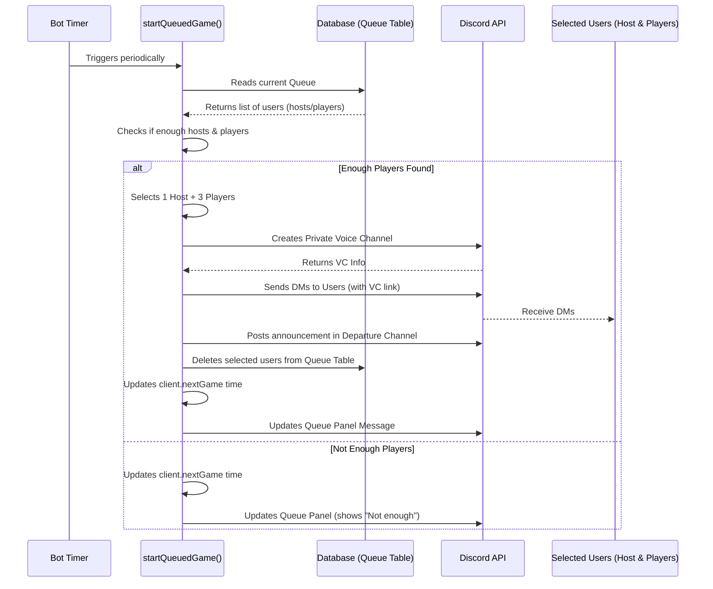

# Chapter 6: Queue Management

Welcome back! In [Chapter 5: Deployment Management](05_deployment_management.md), we explored how the bot helps organize **scheduled** game sessions, like setting up a mission for next Saturday. But what if you and some friends want to jump into a game *right now*? How can the bot help organize spontaneous, unplanned sessions?

That's where the **Queue Management** system comes in!

**What Problem Does Queue Management Solve?**

Imagine you want to play a quick game of Helldivers 2, but you don't have a full squad ready. You could try asking in chat, "Anyone want to play?", but messages get lost, people respond at different times, and it's hard to tell when you have enough players and someone willing to host.

*   **Use Case Example:** You feel like diving into a "Hot Drop" (a quick, impromptu game). You need a way to:
    1.  Signal that you're ready to play *now*.
    2.  Find other available players and potential hosts.
    3.  Automatically get grouped up when enough people are ready.
    4.  Get notified with a dedicated voice channel for your new group.

Manually coordinating this can be slow and messy. The Queue Management system automates this process, acting like a waiting list and an automatic matchmaker for these instant games.

**What is Queue Management? The Impromptu Matchmaker**

Think of the Queue Management system as a live waiting room for players eager to start a game immediately. It's completely separate from the scheduled deployments we discussed in Chapter 5.

Here's the core idea:
1.  **Waiting List:** Players use bot commands (usually buttons) to join a queue, indicating if they just want to play or if they're willing to host.
2.  **Periodic Checks:** The bot constantly checks the queue (e.g., every few minutes).
3.  **Matchmaking:** If it finds enough players (e.g., 3 players) and at least one host, it forms a group.
4.  **Automation:** For each new group, the bot automatically:
    *   Creates a temporary private voice channel.
    *   Generates a deployment message (often in a specific channel and via DMs).
    *   Notifies the selected host and players.
    *   Removes those users from the queue.

This allows groups to form quickly and efficiently without manual coordination.

**Key Components:**

1.  **The Queue Panel:** A message posted by the bot (usually via the `/queue-panel` command) that displays the current queue status (how many hosts/players are waiting) and has buttons to interact with the queue. This panel is kept up-to-date automatically.
2.  **The `Queue` Database Table:** A list stored in the bot's database (see [Chapter 7: Database Entities (TypeORM)](07_database_entities__typeorm_.md)) that keeps track of everyone currently waiting. It stores the user's ID, whether they are a host (`true`/`false`), and when they joined.
3.  **The `QueueStatusMsg` Database Table:** Stores the channel and message ID of the Queue Panel so the bot knows which message to update.
4.  **The Timer (`startQueuedGame`):** An internal timer (using the `interval` property on our [Client (CustomClient)](01_client__customclient_.md)) that runs periodically to check the queue and try to form games.
5.  **Hot Drop vs. Battalion Strike Mode:** The bot might have different modes. "Hot Drop" usually forms groups based on who joined first (First-In, First-Out). "Battalion Strike" mode might select players randomly from the queue, adding an element of surprise. This mode can be toggled using a command like `/togglestrikemode` (controlled by `client.battalionStrikeMode` from Chapter 1).

**How Users Interact with the Queue**

Users typically interact via buttons on the Queue Panel message.

1.  **Displaying the Panel:** An administrator usually uses a command like `/queue-panel` (defined in `src/slashCommands/queue-panel.ts`) to post the initial Queue Panel message in a designated channel.

    ```typescript
    // File: src/slashCommands/queue-panel.ts (Simplified 'func')
    import Slashcommand from "../classes/Slashcommand.js";
    import QueueStatusMsg from "../tables/QueueStatusMsg.js";
    import buildQueueEmbed from "../utils/embedBuilders/buildQueueEmbed.js";
    import { ActionRowBuilder, ButtonBuilder } from "discord.js";
    // ... other imports

    export default new Slashcommand({
        name: "queue-panel",
        description: "Send the queue panel",
        permissions: ["ManageRoles"], // Only admins/mods can use
        // ... other properties ...
        func: async function({ interaction }) {
            // 1. Build the initial embed showing queue status
            const embed = await buildQueueEmbed(/* ... parameters ... */);

            // 2. Create buttons ('host', 'join', 'leave')
            const row = new ActionRowBuilder<ButtonBuilder>().addComponents(
                /* ... buildButton("host"), buildButton("join"), etc ... */
            );

            // 3. Send the message with embed and buttons
            const msg = await interaction.channel.send({ embeds: [embed], components: [row] });

            // 4. Save message details to DB so bot can find and update it later
            await QueueStatusMsg.upsert( // Add or update entry
                { id: 1, channel: interaction.channelId, message: msg.id },
                ["id"] // Conflict target
            );

            // 5. Confirm to the user
            await interaction.reply({ content: "Queue panel sent!", ephemeral: true });
        }
    });
    ```
    *   This command creates the visual panel with buttons and saves its location (`channelId`, `messageId`) to the `QueueStatusMsg` table.

2.  **Joining as a Player:** Users click the "Join" button.

    ```typescript
    // File: src/buttons/join.ts (Simplified 'func')
    import Button from "../classes/Button.js";
    import Queue from "../tables/Queue.js";
    import updateQueueMessages from "../utils/updateQueueMessage.js";
    // ... other imports

    export default new Button({
        id: "join",
        // ... properties like cooldown ...
        func: async function ({ interaction }) {
            // 1. Check if user is already in queue (as non-host)
            const alreadyQueued = await Queue.findOne({ where: { user: interaction.user.id, host: false } });
            if (alreadyQueued) { /* Tell user they are already queued */ return; }

            // 2. Check if player queue is full (based on config)
            // if (playersInQueue >= config.queueMaxes.players) { /* Tell user queue is full */ return; }

            // 3. Add or update user in the Queue database table
            const joinTime = new Date();
            await Queue.upsert( // Add new or update existing entry for this user
                { user: interaction.user.id, host: false, joinTime: joinTime /*, receiptMessageId: ... */ },
                ["user"] // If user exists, update; otherwise insert
            );

            // 4. Send a confirmation DM (receipt) - Optional
            // await interaction.user.send("You joined the queue!");

            // 5. Update the Queue Panel message display
            await updateQueueMessages(/* ... parameters ... */);

            // (Acknowledge the button click silently)
            await interaction.deferUpdate();
        }
    });
    ```
    *   This button's logic checks conditions, adds the user to the `Queue` table as `host: false`, sends a DM receipt, and updates the main panel.

3.  **Joining as a Host:** Users click the "Host" button (requires a specific role).

    ```typescript
    // File: src/buttons/host.ts (Simplified 'func')
    import Button from "../classes/Button.js";
    import Queue from "../tables/Queue.js";
    import updateQueueMessages from "../utils/updateQueueMessage.js";
    import config from "../config.js";
    // ... other imports

    export default new Button({
        id: "host",
        requiredRoles: [{ role: config.hostRole, required: true }], // Only users with host role
        // ... other properties ...
        func: async function({ interaction }) {
            // 1. Check if user is already in queue as host
            const alreadyQueued = await Queue.findOne({ where: { user: interaction.user.id, host: true } });
            if (alreadyQueued) { /* Tell user they are already hosting */ return; }

            // 2. Check if host queue is full
            // if (hostsInQueue >= config.queueMaxes.hosts) { /* Tell user queue is full */ return; }

            // 3. Add or update user in the Queue database table as host
            const joinTime = new Date();
            await Queue.upsert(
                { user: interaction.user.id, host: true, joinTime: joinTime /*, receiptMessageId: ... */ },
                ["user"]
            );

            // 4. Send confirmation DM
            // await interaction.user.send("You joined as host!");

            // 5. Update the Queue Panel message display
            await updateQueueMessages(/* ... parameters ... */);

            await interaction.deferUpdate();
        }
    });
    ```
    *   Similar to "Join", but sets `host: true` in the database and requires the configured host role.

4.  **Leaving the Queue:** Users click the "Leave" button.

    ```typescript
    // File: src/buttons/leave.ts (Simplified 'func')
    import Button from "../classes/Button.js";
    import Queue from "../tables/Queue.js";
    import updateQueueMessages from "../utils/updateQueueMessage.js";
    // ... other imports

    export default new Button({
        id: "leave",
        // ... properties ...
        func: async function ({ interaction }) {
            // 1. Check if user is actually in the queue
            const queuedUser = await Queue.findOne({ where: { user: interaction.user.id } });
            if (!queuedUser) { /* Tell user they are not queued */ return; }

            // 2. Remove the user from the Queue database table
            await Queue.delete({ user: interaction.user.id });

            // 3. Edit the confirmation DM (receipt) to show they left - Optional
            // try { edit receipt message } catch { /* ignore error */ }

            // 4. Update the Queue Panel message display
            await updateQueueMessages(/* ... parameters ... */);

            await interaction.deferUpdate();
        }
    });
    ```
    *   This simply removes the user's entry from the `Queue` table and updates the panel.

**How the System Works: Automatic Matchmaking**

The real magic happens in the background with the periodic timer.

1.  **Timer Trigger:** A timer set up when the bot starts (in `src/events/client/ready.ts`, likely using `setInterval`) calls a function like `startQueuedGame` (found in `src/utils/startQueuedGame.ts`) every few minutes. The time until the *next* check is stored in `client.nextGame`.

2.  **`startQueuedGame` Execution:**
    *   **Fetch Queue:** Reads all current entries from the `Queue` database table.
    *   **Separate Hosts & Players:** Splits the list into hosts and players.
    *   **Check Minimums:** Checks if there's at least 1 host and at least 3 players (these numbers are configurable in [Configuration (`config.ts`)](09_configuration___config_ts__.md)). If not, it updates the queue panel to show "Not enough players" and waits for the next timer cycle.
    *   **Form Groups:** If minimums are met, it starts forming groups:
        *   Takes the first available host.
        *   Takes the first 3 available players (or randomly selects 3 if `client.battalionStrikeMode` is true).
        *   Removes these selected users from the temporary lists.
        *   Repeats if there are enough remaining hosts and players to form more groups.
    *   **Process Each Group:** For every group formed:
        *   **Create Voice Channel:** Creates a new, temporary voice channel in a specific category (defined in config). It sets permissions so only the host and the 3 players can join and see it. It might generate a random code for the channel name.
        *   **Store VC Info:** Saves the new voice channel ID to a `VoiceChannel` database table so it can be cleaned up later.
        *   **Send Notifications:**
            *   Sends a Direct Message (DM) to the host with details (VC link, players in squad).
            *   Sends DMs to each player (VC link, host name).
            *   Posts a message in a public "departure" channel announcing the new Hot Drop/Strike group, listing the participants and the voice channel.
        *   **Remove from Database:** Deletes the selected host and players from the main `Queue` database table.
    *   **Update Queue Panel:** After processing all groups, it calls `updateQueueMessages` to refresh the main panel, showing the remaining users in the queue and the time of the next check (`client.nextGame`).

**Simplified Automatic Grouping Flow:**



**Internal Implementation Snippets:**

*   **Database Model (`Queue.ts`):** Defines the structure for storing queue members.

    ```typescript
    // File: src/tables/Queue.ts (Simplified)
    import { Entity, PrimaryGeneratedColumn, Column, BaseEntity } from "typeorm";

    @Entity() // Tells TypeORM this is a database table
    export default class Queue extends BaseEntity {
        @PrimaryGeneratedColumn() // Auto-incrementing ID
        id: number;

        @Column() // Stores the Discord User ID (string)
        user: string;

        @Column({ type: "boolean" }) // Is this user a host? (true/false)
        host: boolean;

        @Column({ nullable: true }) // Message ID of the DM receipt (optional)
        receiptMessageId: string;

        @Column({ type: "timestamp", nullable: true }) // When the user joined
        joinTime: Date;
    }
    ```
    *   This defines the columns in the `Queue` table, matching the information needed by the system.

*   **Starting a Game (`startQueuedGame.ts`):** High-level logic.

    ```typescript
    // File: src/utils/startQueuedGame.ts (Highly Simplified)
    import Queue from "../tables/Queue.js";
    import { client, getDeploymentTime } from "../index.js";
    import updateQueueMessages from "./updateQueueMessage.js";
    import config from "../config.js";
    // ... other imports (VC creation, DMs, etc.)

    export const startQueuedGame = async () => {
        const queue = await Queue.find(); // Get everyone waiting
        const hosts = queue.filter(q => q.host);
        const players = queue.filter(q => !q.host);

        // Calculate when the next check should be
        client.nextGame = new Date(Date.now() + await getDeploymentTime());

        // Check if we have enough people
        if (hosts.length < config.minHosts || players.length < config.minPlayers) {
            await updateQueueMessages(true, client.nextGame.getTime()); // Update panel: Not enough
            return;
        }

        // --- Group Formation Logic ---
        // (Simplified: take first host, first 3 players)
        const host = hosts.shift();
        const selectedPlayers = players.splice(0, config.minPlayers);

        // --- Process the Group ---
        // 1. Create Voice Channel (using Discord API)
        // const vc = await createVoiceChannel(host, selectedPlayers);

        // 2. Send DMs (using Discord API)
        // await sendDMs(host, selectedPlayers, vc);

        // 3. Post Departure Message (using Discord API)
        // await postDepartureMessage(host, selectedPlayers, vc);

        // 4. Remove users from DB
        await Queue.delete({ user: host.user });
        for (const player of selectedPlayers) {
            await Queue.delete({ user: player.user });
        }

        // --- Update Panel ---
        await updateQueueMessages(false, client.nextGame.getTime(), true); // Update panel: Success
    };
    ```
    *   This skeleton shows the core flow: get queue -> check counts -> form group -> create VC -> notify -> remove from DB -> update panel.

**Conclusion**

The Queue Management system provides a powerful way to organize spontaneous "Hot Drop" or "Strike" game sessions. It acts as an automated waiting list and matchmaker:
*   Users join via buttons on a central **Queue Panel**.
*   The bot periodically checks the **`Queue` database**.
*   If enough **hosts and players** are found, it automatically creates **voice channels**, sends **notifications**, and removes players from the queue.
*   This system runs alongside, but separately from, the scheduled [Deployment Management](05_deployment_management.md).

This relies heavily on storing user information in the database. How exactly are these database structures defined and interacted with?

Next up: [Chapter 7: Database Entities (TypeORM)](07_database_entities__typeorm_.md)

