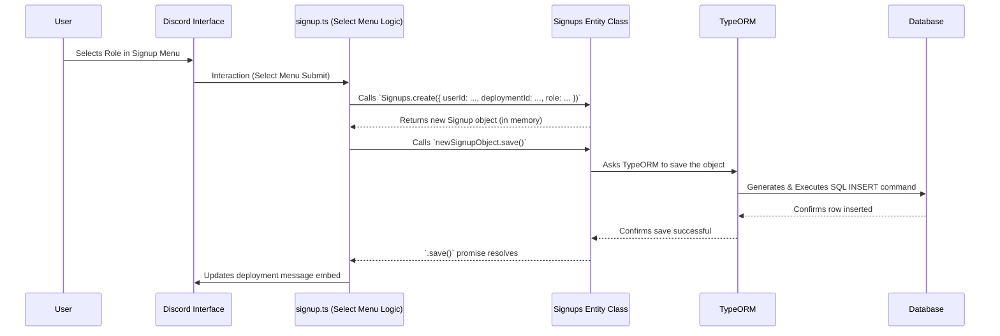

# Chapter 7: Database Entities (TypeORM)

Welcome back! In [Chapter 6: Queue Management](06_queue_management.md), we saw how the bot manages players waiting for immediate games using a queue system. We mentioned that information about who is in the queue, scheduled deployments ([Chapter 5: Deployment Management](05_deployment_management.md)), who signed up for them, and who backed them up needs to be stored reliably.

But where does all this important information go? If the bot restarts, how does it remember the details of a deployment scheduled for next week, or who was waiting in the queue? We can't just keep it in temporary memory!

**What Problem Do Database Entities Solve? Storing Data Reliably**

Imagine you're organizing a big event and writing down guest names, meal choices, and arrival times on sticky notes. It works for a few people, but what happens if the wind blows them away? Or if you need to quickly find everyone who ordered the vegetarian option? It gets messy and unreliable fast.

Our bot faces a similar challenge. It needs a structured and persistent way to store data like:
*   Deployment details (title, time, host)
*   Who signed up for which deployment and in what role (`Signups`)
*   Who is on the backup list (`Backups`)
*   Who is currently waiting in the instant game queue (`Queue`)
*   Which message is the queue panel (`QueueStatusMsg`)
*   Temporary voice channels created for queue games (`VoiceChannel`)

*   **Use Case Example:** When a user signs up for a deployment using the select menu (as seen in Chapter 5), the bot needs to:
    1.  Record the user's ID.
    2.  Record the specific deployment they signed up for.
    3.  Record the role they selected.
    4.  Save this information somewhere safe so it's remembered even if the bot restarts.
    5.  Be able to easily retrieve this information later to display the list of signups on the deployment message.

We need a robust system for storing, organizing, and retrieving this data. This is where databases and **Database Entities** come in.

**What are Entities? The Database Blueprints**

Think of a database as a highly organized digital filing cabinet. Inside, you have different sections (called **tables**) for specific types of information. For example, one table for Deployments, another for Signups, another for Queue members.

A **Database Entity** is like a **blueprint** for one of these tables. In our project, it's a TypeScript class that describes exactly what kind of information goes into a specific table and what each piece of information is called.

*   **Class = Table:** Each entity class (like `Deployment`, `Queue`, `Signups`) corresponds directly to a table in the database.
*   **Properties = Columns:** The properties defined within the class (like `title`, `startTime` in the `Deployment` class, or `userId`, `role` in the `Signups` class) correspond to the columns in that table.

Here's a simplified example of the blueprint for the `Signups` table:

```typescript
// File: src/tables/Signups.ts (Simplified)
import { Entity, PrimaryGeneratedColumn, Column, BaseEntity } from "typeorm";

@Entity() // Tells TypeORM: "This class defines a database table"
export default class Signups extends BaseEntity {
    @PrimaryGeneratedColumn() // Defines an auto-incrementing ID column (unique key)
    id: number;

    @Column() // Defines a column to store the user's Discord ID (string)
    userId: string;

    @Column() // Defines a column to store the ID of the deployment they joined
    deploymentId: number;

    @Column() // Defines a column to store the role they signed up for (string)
    role: string;
}
```
This `Signups` class acts as the blueprint. It tells us that the `Signups` table in our database will have columns named `id`, `userId`, `deploymentId`, and `role`.

**What is TypeORM? The Blueprint Translator and Manager**

Okay, so we have these blueprints (Entities). But how do they actually connect to the real database? How does the bot use these blueprints to save or retrieve data without writing complex database code (like SQL)?

That's where **TypeORM** comes in. TypeORM is an "Object-Relational Mapper" (ORM). Think of it as a skilled translator and construction manager:

1.  **Reads Blueprints:** It looks at our Entity classes (like `Signups.ts`, `Deployment.ts`).
2.  **Manages Database:** It connects to the actual database (using connection details from our [Configuration (`config.ts`)](09_configuration___config_ts__.md)).
3.  **Builds/Updates Tables:** It can automatically create or update the database tables to perfectly match the structure defined in our blueprints (Entities). This is often called "synchronization".
4.  **Translates Actions:** Most importantly, it lets us work with our database using simple JavaScript/TypeScript commands (like creating objects, calling `.save()`, `.find()`, `.delete()`) instead of writing raw SQL queries. TypeORM translates our object-oriented actions into the appropriate SQL commands for the database.

**Examples in Deployment-bot**

The `src/tables/` directory contains all the entity blueprints used by the bot:

*   `Deployment.ts`: Stores details about scheduled game sessions (title, time, host, message ID, status flags, etc.).
*   `Signups.ts`: Tracks which users signed up for which deployment and their role.
*   `Backups.ts`: Tracks which users signed up as backups for a deployment.
*   `Queue.ts`: Tracks users currently waiting in the instant game queue (user ID, host status, join time).
*   `QueueStatusMsg.ts`: Remembers where the main queue panel message is located.
*   `VoiceChannel.ts`: Keeps track of temporary voice channels created for queue games so they can be deleted later.
*   `LatestInput.ts`: Remembers the last input a user provided for certain commands (like deployment creation).
*   `StrikeCategory.ts`: Stores configuration related to the "Battalion Strike" queue mode.

Let's look at a simplified `Deployment.ts` blueprint:

```typescript
// File: src/tables/Deployment.ts (Simplified)
import { Entity, PrimaryGeneratedColumn, Column, BaseEntity } from "typeorm";

@Entity() // Blueprint for the 'Deployment' table
export default class Deployment extends BaseEntity {
    @PrimaryGeneratedColumn() // Unique ID for each deployment
    id: number;

    @Column() // Channel where the deployment message is
    channel: string;

    @Column() // Message ID of the deployment message
    message: string;

    @Column() // User ID of the person who created it
    user: string;

    @Column() // Title of the deployment
    title: string;

    @Column({ type: "bigint" }) // Start time (stored as a large number)
    startTime: number;

    @Column({ default: false }) // Has the reminder been sent? (defaults to false)
    noticeSent: boolean;

    @Column({ default: false }) // Has the deployment started?
    started: boolean;

    @Column({ default: false }) // Is it marked for deletion?
    deleted: boolean;
}
```
*   `@Entity()`: Marks this class as a database table blueprint.
*   `@PrimaryGeneratedColumn()`: Creates a unique `id` for each record automatically. This is the primary key.
*   `@Column()`: Defines a regular column. We can specify types (`bigint`) or default values (`default: false`).

**Using Entities: Create, Read, Update, Delete (CRUD)**

Thanks to TypeORM and our Entity blueprints, interacting with the database becomes much more intuitive. We can perform the basic database operations (CRUD) using methods directly on our entity classes.

1.  **Create (Saving New Data):**
    Remember how we created a deployment in [Chapter 5: Deployment Management](05_deployment_management.md)? We used the `Deployment` entity.

    ```typescript
    // Simplified snippet from src/modals/newDeployment.ts
    import Deployment from "../tables/Deployment.js"; // Import the blueprint

    // ... inside the async func after getting data ...

    // Create a new Deployment object based on the blueprint
    const newDeployment = Deployment.create({
        channel: channelId,
        message: message.id,
        user: interaction.user.id,
        title: title,
        startTime: startDate.getTime(),
        // other properties...
    });

    // Tell TypeORM to save this new object to the database
    await newDeployment.save();
    // TypeORM generates and runs an SQL INSERT command behind the scenes.
    ```
    We create a JavaScript object matching the `Deployment` blueprint's structure and then call `.save()` to persist it.

2.  **Read (Finding Existing Data):**
    In [Chapter 6: Queue Management](06_queue_management.md), the bot needed to find everyone in the queue.

    ```typescript
    // Simplified snippet from src/utils/startQueuedGame.ts
    import Queue from "../tables/Queue.js"; // Import the Queue blueprint

    // Find ALL records in the 'Queue' table
    const allQueuedUsers = await Queue.find();
    // TypeORM generates and runs an SQL SELECT * FROM queue command.

    // --- Or find a SPECIFIC record ---
    // Example: Find a specific deployment by its message ID
    import Deployment from "../tables/Deployment.js";
    const deployment = await Deployment.findOne({
        where: { message: interaction.message.id }
    });
    // TypeORM generates SELECT * FROM deployment WHERE message = '...' LIMIT 1
    ```
    We use `.find()` to get multiple records or `.findOne()` (often with a `where` clause) to get a single specific record.

3.  **Update (Changing Existing Data):**
    When a deployment starts, the bot needs to mark it as `started` in the database.

    ```typescript
    // Simplified logic for marking a deployment as started
    import Deployment from "../tables/Deployment.js";

    // 1. Find the deployment that needs updating
    const deploymentToUpdate = await Deployment.findOne({ where: { id: deploymentId } });

    if (deploymentToUpdate) {
        // 2. Change the property on the retrieved object
        deploymentToUpdate.started = true;
        deploymentToUpdate.noticeSent = true; // Example: also update reminder status

        // 3. Save the changes back to the database
        await deploymentToUpdate.save();
        // TypeORM generates and runs an SQL UPDATE command for this specific record.
    }
    ```
    We find the record, change its properties in our code, and then `.save()` the *same object* again. TypeORM is smart enough to know this means "update" instead of "create new".

4.  **Delete (Removing Data):**
    When a user leaves the queue ([Chapter 6: Queue Management](06_queue_management.md)).

    ```typescript
    // Simplified snippet from src/buttons/leave.ts
    import Queue from "../tables/Queue.js"; // Import the Queue blueprint

    // Find the user's entry in the queue table
    const userInQueue = await Queue.findOne({ where: { user: interaction.user.id } });

    if (userInQueue) {
        // Remove the record from the database
        await userInQueue.remove();
        // Or, you can delete by criteria directly:
        // await Queue.delete({ user: interaction.user.id });
        // TypeORM generates and runs an SQL DELETE command.
    }
    ```
    We can find the record and call `.remove()` on it, or use the static `.delete()` method with criteria.

**Internal Implementation: How it Connects**

How does the bot set up this TypeORM connection and tell it about our entity blueprints?

1.  **Decorators are Instructions:** As mentioned, the `@Entity()`, `@Column()`, `@PrimaryGeneratedColumn()`, etc., decorators inside the entity files (`src/tables/*.ts`) are special markers. TypeORM reads these markers to understand the database structure.

2.  **Database Handler (`databaseHandler.ts`):** Remember the handlers from [Chapter 3: Handlers (Loading & Routing)](03_handlers__loading___routing_.md)? There's one specifically for the database: `src/handlers/databaseHandler.ts`. When the bot starts, this handler does the following:
    *   **Reads Config:** It gets the database connection details (like type, host, username, password, database name) from `config.ts`.
    *   **Finds Entities:** It automatically scans the `src/tables/` directory to find all files exporting classes marked with `@Entity()`.
    *   **Initializes TypeORM:** It creates a `DataSource` object from TypeORM, telling it the connection details and the list of all entity blueprints it found.
    *   **Connects:** It establishes the actual connection to the database.
    *   **Synchronizes (Optional):** Based on the `synchronize: true` setting in `config.ts` (usually `true` for development, `false` for production), TypeORM compares the blueprints with the actual database tables. If they don't match, it automatically alters the database tables (creates missing ones, adds/removes columns) to match the blueprints. *Caution: `synchronize: true` can delete data in production if used carelessly!*

Here's a simplified view of the `databaseHandler.ts` setup:

```typescript
// File: src/handlers/databaseHandler.ts (Simplified)
import { DataSource } from "typeorm";
import { readdirSync } from "fs";
import config from "../config.js"; // Database settings from config
import path from "path";
// ... other imports ...

// 1. Find all entity files in src/tables/
const entityFiles = readdirSync(path.resolve(__dirname, "../tables/"))
    .filter(file => file.endsWith(".js") || file.endsWith(".ts"));

// 2. Import all the entity classes dynamically
const entities = [];
for (const file of entityFiles) {
    const entityModule = await import(`../tables/${file}`);
    entities.push(entityModule.default); // Add the class (e.g., Deployment, Queue)
}

// 3. Create the TypeORM DataSource (connection configuration)
const AppDataSource = new DataSource({
    ...(config.database as any), // Spread database settings from config.ts
    entities: entities, // Tell TypeORM about our blueprints
    synchronize: config.synchronizeDatabase, // Should TypeORM auto-update tables?
    // ... other options ...
});

// 4. Connect to the database!
await AppDataSource.initialize(); // Establish connection & synchronize if needed

export default AppDataSource; // Export the connected source for other parts of the bot
```

**Flow Diagram: Saving a Signup**

Let's visualize how saving a new signup using an Entity works:


This shows how the application logic (in `signup.ts`) uses the `Signups` entity class methods, which TypeORM then translates into actual database operations.

**Conclusion**

Database Entities, powered by TypeORM, are the foundation for storing all persistent data in the `Deployment-bot`.

*   **Entities (`src/tables/*.ts`)** act as **blueprints** defining the structure of database tables.
*   **TypeORM** acts as the **translator**, allowing us to interact with the database using simple object-oriented methods (`.create()`, `.save()`, `.find()`, `.delete()`) instead of raw SQL.
*   This system reliably stores information about deployments, signups, backups, queues, and more, ensuring data isn't lost when the bot restarts.
*   The `databaseHandler.ts` initializes this connection during bot startup.

We often retrieve data using these entities (like fetching deployment details and signups) and then need to display it nicely to the user in Discord messages. How do we build those complex, good-looking messages (Embeds)?

Next up: [Chapter 8: Embed Builders](08_embed_builders.md)

---

