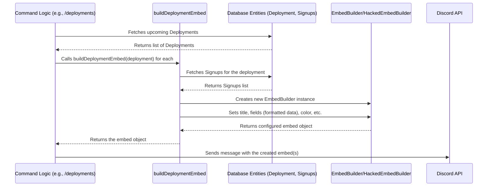

# Chapter 8: Embed Builders

Welcome back! In [Chapter 7: Database Entities (TypeORM)](07_database_entities__typeorm_.md), we saw how the bot uses blueprints (Entities) and TypeORM to store important information like deployment details and queue members in a database. This data is crucial, but just storing it isn't enough – we need to present it to users in a clear and attractive way!

How does the bot create those nicely formatted messages with titles, colors, columns, and images that display deployment signups or the current queue status? Doing this manually for every message would be repetitive and prone to inconsistencies.

**What Problem Do Embed Builders Solve? Easy & Consistent Message Formatting**

Imagine you're sending party invitations. You could just text everyone the details: "Party at my place, Sat 7pm, bring snacks". It works, but it's plain. Or, you could design a beautiful invitation card with a theme, clear sections for What, When, Where, and maybe even a picture. The second option looks much better and is easier to read!

Discord has a feature similar to invitation cards called **Embeds**. These are special messages that can include:
*   Titles and descriptions
*   Colors along the side
*   Images and thumbnails
*   Neatly arranged text in fields (like columns)
*   Author and footer information
*   Timestamps

Creating these embeds manually requires constructing complex data structures every time. If you want all your "success" messages to look similar (e.g., green color, checkmark icon), you'd have to remember to apply those styles consistently everywhere.

*   **Use Case Example:** When the bot needs to display the list of upcoming deployments, it needs to:
    1.  Fetch the deployment data from the database.
    2.  Format this data into a visually appealing embed message.
    3.  Ensure this message looks consistent with other deployment-related messages (e.g., using the same footer text and icon).
    4.  If there are no deployments, display a specific "empty state" embed, also styled consistently.

**Embed Builders** are helper tools created specifically to solve this problem. They make creating these rich embed messages much easier and ensure a consistent look and feel across the bot.

**What are Embed Builders? Message Templates & Tools**

Think of Embed Builders as specialized template engines or toolkits for creating Discord embeds:

1.  **Discord Embeds:** The final product – the fancy, formatted message box seen in Discord.
2.  **Helper Functions (`buildEmbed`, `buildDeploymentEmbed`, `buildQueueEmbed`):** These are like pre-made templates or recipes for specific types of messages.
    *   `buildDeploymentEmbed`: Knows how to take deployment data (from the database) and format it into the standard deployment announcement embed.
    *   `buildQueueEmbed`: Knows how to take the current queue status (from the database) and format it into the queue panel embed.
    *   `buildEmbed`: A general-purpose builder, often used for simple messages like success confirmations, errors, or info pop-ups. It heavily relies on predefined styles.
3.  **Configuration Presets ([`config.ts`](09_configuration___config_ts__.md)):** The bot's configuration file stores default styles (colors, titles, thumbnails) for common message types like "success" or "error". The `buildEmbed` function uses these presets to ensure consistency.
4.  **`HackedEmbedBuilder` (Custom Class):** A slightly modified version of Discord.js's standard `EmbedBuilder`. This custom class allows for a specific visual trick (having fields without visible names, used for layout in the queue embed) that the standard builder doesn't easily support. It's a small tweak for more layout flexibility.

Together, these components allow developers to generate complex embeds with just a few lines of code, ensuring they follow the bot's visual standards.

**How It's Used: Creating the Queue Panel Embed**

Let's revisit the Queue Panel from [Chapter 6: Queue Management](06_queue_management.md). How is its embed generated and updated? It uses the `buildQueueEmbed` helper.

1.  **Fetch Data:** The code first gets the current state of the queue from the database ([Chapter 7: Database Entities (TypeORM)](07_database_entities__typeorm_.md)).

    ```typescript
    // Simplified context where the queue panel needs updating
    import Queue from "../../tables/Queue.js";
    import buildQueueEmbed from "../../utils/embedBuilders/buildQueueEmbed.js";
    import { client } from "../../index.js";
    import QueueStatusMsg from "../../tables/QueueStatusMsg.js";

    // ... assume we know the channel and message to update ...
    const queuePanelInfo = await QueueStatusMsg.findOne({ where: { id: 1 } });
    const channel = await client.channels.fetch(queuePanelInfo.channel);
    const messageToUpdate = await channel.messages.fetch(queuePanelInfo.message);

    // Get necessary state for the embed
    const notEnoughPlayers = /* ... check queue counts ... */ false;
    const deploymentCreated = /* ... check if a game just started ... */ true;
    const nextTime = client.nextGame.getTime(); // Get next check time from client
    ```
    This setup gets the current queue state and other relevant info like the next scheduled check time.

2.  **Call the Builder:** Instead of manually creating the embed structure, we just call our helper function:

    ```typescript
    // Call the specific builder for the queue embed
    const queueEmbed = await buildQueueEmbed(
        notEnoughPlayers, // Pass in whether we have enough players
        nextTime,         // Pass in the timestamp for the next game check
        deploymentCreated,// Pass in whether a game was just created
        channel           // Pass in the channel object (used to fetch member names)
    );
    ```
    We pass the necessary information (like `notEnoughPlayers`, `nextTime`) to the `buildQueueEmbed` function.

3.  **Use the Result:** The function returns a fully configured embed object, ready to be sent or used to update an existing message.

    ```typescript
    // Update the existing queue panel message with the new embed
    await messageToUpdate.edit({ embeds: [queueEmbed] });
    ```
    The `buildQueueEmbed` function handles all the complex logic of fetching queue members, formatting names, adding instructions, and applying the correct title and fields.

**How It's Used: Creating Simple Preset Embeds**

For common messages like success or error confirmations, the general `buildEmbed` function is used with presets defined in [`config.ts`](09_configuration___config_ts__.md).

```typescript
// Example: Sending a simple success message after an action
import { buildEmbed } from "../utils/embedBuilders/configBuilders.js";

// ... inside a command's function after a successful operation ...
const successEmbed = buildEmbed({
    preset: "success", // Use the 'success' preset from config.ts
    placeholders: { action: "deleting the deployment" } // Optional text replacements
});

// The config might define success preset with:
// - Green color
// - Checkmark thumbnail
// - Generic title like "Success!" (or maybe null)
// - Description template like "Successfully completed {action}."

await interaction.reply({ embeds: [successEmbed], ephemeral: true });
```
*   `preset: "success"` tells the builder to look up the pre-defined styles for "success" messages in `config.ts`.
*   `placeholders` allow customizing parts of the preset text (like the description).
*   This makes sending standard feedback messages incredibly simple and ensures they all look alike.

**Internal Implementation: How `buildEmbed` Works**

Let's peek inside the general `buildEmbed` function (simplified):

```typescript
// File: src/utils/embedBuilders/configBuilders.ts (Simplified buildEmbed)
import { EmbedBuilder } from "discord.js";
import config from "../../config.js"; // Import configuration

export function buildEmbed({ name, preset, embed, placeholders }: { /* types */ }) {
    if (!embed) embed = new EmbedBuilder(); // Create a base embed if not provided

    // Get preset styles and default styles from config
    const presetStyles = config.embeds.presets[preset] || {};
    const defaultStyles = config.embeds.presets.default;
    const specificStyles = config.embeds[name] || {}; // Specific named embed styles

    // Helper to replace placeholders like {timestamp}
    const format = (string) => { /* ... replaces placeholders ... */ return string; };

    // Apply styles: Specific > Preset > Default
    embed.setTitle(format(specificStyles.title ?? presetStyles.title ?? defaultStyles.title));
    embed.setDescription(format(specificStyles.description ?? presetStyles.description ?? defaultStyles.description));
    embed.setColor(specificStyles.color ?? presetStyles.color ?? defaultStyles.color);
    embed.setThumbnail(specificStyles.thumbnail ?? presetStyles.thumbnail ?? defaultStyles.thumbnail);
    // ... apply other properties like footer, author, timestamp ...

    return embed; // Return the configured embed object
}
```
*   It creates a standard `EmbedBuilder`.
*   It fetches style definitions from `config.ts` based on the provided `preset` or `name`.
*   It applies these styles (title, description, color, thumbnail, etc.) to the embed object, using defaults if specific styles aren't found.
*   It replaces any `placeholders` in the text.
*   It returns the fully styled `EmbedBuilder`.

**Internal Implementation: How `HackedEmbedBuilder` Works**

The `HackedEmbedBuilder` makes a small change to allow fields without visible names, useful for layout spacing.

```typescript
// File: src/classes/HackedEmbedBuilder.ts (Simplified)
import { EmbedBuilder } from "discord.js";

// Extend the standard EmbedBuilder
export default class HackedEmbedBuilder extends EmbedBuilder {
    // Override the addFields method
    addFields(...fields) {
        // Go through each field provided
        const modifiedFields = fields.map(field => ({
            // If name is missing/null, use empty string '' instead of erroring
            name: field.name ?? '',
            // If value is missing/null, use empty string ''
            value: field.value ?? '',
            inline: field.inline || false,
        }));

        // Add the modified fields directly to the internal data structure
        // This bypasses the standard validation that forbids empty names.
        this.data.fields = (this.data.fields || []).concat(modifiedFields);
        return this; // Allow chaining methods like .setTitle()
    }
}
```
*   It inherits from `EmbedBuilder`.
*   It replaces the standard `addFields` method.
*   Inside, it ensures `name` and `value` default to `''` (empty string) if they are not provided (`null` or `undefined`).
*   It then adds these potentially "nameless" fields directly to the embed's data, skipping the normal checks. Functions like `buildQueueEmbed` use this custom builder.

**Internal Implementation: How Specific Builders (`buildQueueEmbed`) Work**

Specific builders like `buildQueueEmbed` combine data fetching with embed construction using (usually) the `HackedEmbedBuilder`.

```typescript
// File: src/utils/embedBuilders/buildQueueEmbed.ts (Simplified Logic)
import Queue from "../../tables/Queue.js";
import { client } from "../../index.js";
import HackedEmbedBuilder from "../../classes/HackedEmbedBuilder.js"; // Use the custom builder

// ... (getFields helper function defined elsewhere) ...

export default async function buildQueueEmbed(notEnoughPlayers, nextTime, created, channel) {
    // 1. Fetch current queue data
    const currentQueue = await Queue.find();

    // 2. Format data into fields (potentially complex logic)
    // This helper fetches names and arranges them into columns
    const fields = await getFields(channel, currentQueue);

    // 3. Determine status message based on inputs
    let statusContent = "Next deployment starting <t:...:R>";
    if (notEnoughPlayers) statusContent = `❌ Not enough players. ${statusContent}`;
    else if (created) statusContent = `✅ Deployment created. ${statusContent}`;

    // 4. Create the embed using HackedEmbedBuilder
    const embed = new HackedEmbedBuilder()
        .setTitle(`🔥 ${client.battalionStrikeMode ? 'Strike Queue' : 'Hot Drop Queue'}`)
        // Add standard instructional text
        .addFields(
            { name: "", value: "...", inline: false }, // Instructions
            { name: "", value: statusContent, inline: false }, // Status line
            // ... more instructional fields ...
        )
        // Add the dynamically generated fields from getFields()
        .addFields(...fields)
        // Add the next game time field
        .addFields({ name: "Next game:", value: `<t:${Math.round(nextTime / 1000)}:F>` });

    // 5. Return the finished embed
    return embed;
}
```
*   It fetches data using database entities ([Chapter 7: Database Entities (TypeORM)](07_database_entities__typeorm_.md)).
*   It uses a helper (`getFields`) to process this data into the complex field structure needed for the queue display.
*   It creates a `HackedEmbedBuilder` instance.
*   It adds standard instructional fields and the dynamically generated fields.
*   It returns the complete embed object.

**Flow Diagram: Command Using `buildDeploymentEmbed`**



This shows how command logic uses the builder, which interacts with the database and the embed class to construct the final message sent via the Discord API.

**Conclusion**

Embed Builders are essential tools in `Deployment-bot` for creating the rich, formatted messages (Embeds) that users see.

*   They simplify the process of creating complex Discord embeds.
*   Helper functions like `buildDeploymentEmbed` and `buildQueueEmbed` act as templates for specific message types, often using data fetched from the database.
*   The general `buildEmbed` function uses **presets** from the configuration file for common messages (success, error), ensuring visual **consistency**.
*   The custom `HackedEmbedBuilder` provides extra layout flexibility.

By using these builders, the bot can present information clearly and attractively without repetitive coding, making the user interface cleaner and the developer's job easier. Many of the styles and presets used by these builders are defined in one central place.

Next up: [Chapter 9: Configuration (`config.ts`)](09_configuration___config_ts__.md)

---

