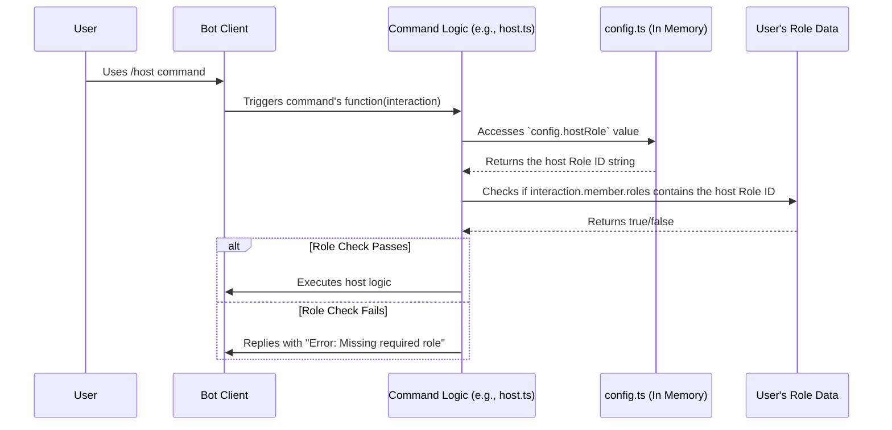

# Chapter 9: Configuration (`config.ts`)

Welcome to the final chapter of our core concepts tour! In [Chapter 8: Embed Builders](08_embed_builders.md), we saw how the bot creates nicely formatted messages (Embeds) and how helper functions like `buildEmbed` can use predefined styles like "success" or "error". We briefly mentioned these styles come from a configuration file.

But where *exactly* do those styles live? And what about other crucial settings, like the bot's secret token, the IDs of channels it should use, or the names of roles it needs to recognize? If you wanted to set up this bot for your own server, where would you put *your* server's specific details?

**What Problem Does `config.ts` Solve? One Place for All Settings**

Imagine you bought a new customizable gadget, like a smart speaker. You need to tell it your Wi-Fi password, your preferred music service, maybe set a default volume level, and choose its voice. You wouldn't want to open up the speaker's internal circuits and solder new connections for each setting! Instead, you'd use a setup app or a settings menu – one central place to adjust everything.

Our `Deployment-bot` is similar. It needs a lot of specific information to work correctly in *your* Discord server:
*   The unique **Bot Token** to log in.
*   The **Database Credentials** to store information ([Chapter 7: Database Entities (TypeORM)](07_database_entities__typeorm_.md)).
*   Specific **Channel IDs** (like where to post deployment announcements or queue updates).
*   Specific **Role IDs** (like who is allowed to host deployments or who is blacklisted).
*   Visual preferences like **Embed colors** and **Button labels** ([Chapter 8: Embed Builders](08_embed_builders.md)).
*   Limits for features like the **Queue size** ([Chapter 6: Queue Management](06_queue_management.md)).

Scattering these settings across many different code files would be a nightmare! If you needed to change the announcement channel, you'd have to hunt through the code. It would also make it hard to share the bot's code without accidentally sharing your secret token.

*   **Use Case Example:** You've downloaded the `Deployment-bot` code and want to run it for your gaming community's Discord server. You need to tell the bot:
    1.  Your specific bot token (from the Discord Developer Portal).
    2.  Your server's unique ID (`guildId`).
    3.  The ID of the channel where you want deployment announcements to appear (`departureChannel`).
    4.  The ID of the role members need to have to use the `/host` command (`hostRole`).
    5.  Your database login details.

How can you provide all this information easily and safely? The answer is `config.ts`.

**What is `config.ts`? The Bot's Control Panel**

Think of the file `src/config.ts` as the bot's central **control panel** or **settings menu**. It's a single file where almost all the customizable values that control the bot's behavior, appearance, and connection details are gathered together.

It's a TypeScript file that exports a large JavaScript object. Inside this object, settings are organized into logical groups.

```typescript
// File: src/config.ts (Simplified Structure)

export default {
    // --- Core Settings ---
    token: "YOUR_BOT_TOKEN_HERE", // VERY IMPORTANT: Replace this!
    guildId: "YOUR_SERVER_ID_HERE", // IMPORTANT: Replace this!
    prefix: "-",

    // --- Database Settings ---
    database: {
        type: "mysql", // Or postgres, sqlite, etc.
        host: "localhost",
        port: 3306,
        username: "db_user",
        password: "db_password",
        database: "deployment_bot_db"
    },

    // --- Channel & Role IDs ---
    departureChannel: "CHANNEL_ID_FOR_ANNOUNCEMENTS",
    hostRole: "ROLE_ID_FOR_HOSTS",
    blacklistedRoles: ["ROLE_ID_TO_BLACKLIST"],
    // ... other IDs ...

    // --- Appearance (Embeds & Buttons) ---
    embeds: {
        presets: { /* ... success, error styles ... */ },
        panel: { /* ... panel embed text ... */ },
        // ... other embed styles ...
    },
    buttons: {
        newDeployment: { label: "Create Deployment", style: "Primary" },
        // ... other button styles ...
    },

    // --- Feature Settings ---
    queueMaxes: { hosts: 50, players: 200 },
    buttonCooldown: 5, // Cooldown in seconds
    roles: [ /* ... Configurable roles for signups ... */ ],

    // --- Debug/Development Flags ---
    debugMode: true,
    synchronizeDatabase: false, // Careful with this in production!
};
```

This structure puts everything you might need to change in one convenient place.

**Key Settings You'll Find (and likely need to change):**

1.  **`token`**: **Essential!** This is the secret key the bot uses to log into Discord. You get this from the Discord Developer Portal. **Keep it secret!**
2.  **`guildId`**: **Essential!** The unique ID of the Discord server (guild) where you intend to run the bot primarily. Many features rely on this.
3.  **`database`**: **Essential!** Contains the connection details for your database (type, host, username, password, database name). The bot needs this to store persistent data using [Chapter 7: Database Entities (TypeORM)](07_database_entities__typeorm_.md).
4.  **Channel IDs (`departureChannel`, `bugReportChannelId`, `vcCategory`, `loggingChannels`)**: These tell the bot *where* to post specific messages (like deployment announcements, queue updates, error logs) or where to create voice channels. You need to replace the default IDs with the actual IDs from *your* server.
5.  **Role IDs (`verifiedRoleId`, `hostRole`, `blacklistedRoles`)**: These link the bot's permission checks and logic to specific roles in *your* server. You need to replace the default IDs with your role IDs.
6.  **`embeds`**: Defines the default appearance (colors, titles, thumbnails) for different types of embeds (success, error, info, specific commands) used by the [Chapter 8: Embed Builders](08_embed_builders.md). You can customize the look and feel here.
7.  **`buttons`**: Defines the default labels, styles (colors), and emojis for buttons used in commands, like the "New Deployment" or "Join Queue" buttons ([Chapter 4: Interaction Abstraction Classes](04_interaction_abstraction_classes.md)).
8.  **Feature Tuning (`queueMaxes`, `buttonCooldown`, `roles`)**: Allows you to adjust parameters like how many people can be in the queue, the cooldown duration for buttons, or the available roles users can sign up for in deployments ([Chapter 5: Deployment Management](05_deployment_management.md)).
9.  **Development Flags (`debugMode`, `synchronizeDatabase`, `resetCommands`)**: Switches used mainly during development to enable extra logging, automatically update the database schema, or reset slash commands. Be cautious with `synchronizeDatabase` in a live environment as it can alter tables.

**How to Use It: Modifying the Settings**

Before you run the bot for the first time, or whenever you need to adjust its behavior, you simply need to:

1.  **Open the file:** Find and open `src/config.ts` in your code editor.
2.  **Edit the values:** Locate the setting you want to change (e.g., `guildId`). Replace the placeholder or default value with your desired value. Make sure to keep the value within the quotes (`" "`) if it's a string (like IDs, tokens, text).
3.  **Save the file.**
4.  **Restart the bot:** If the bot is already running, you'll need to restart it for the changes in `config.ts` to take effect.

**Example:** Changing the `departureChannel`

Let's say the default `config.ts` has:
```typescript
departureChannel: "1297304177021685821", // Default placeholder ID
```
And in your server, the channel you want to use for announcements has the ID `987654321098765432`. You would edit the line to:
```typescript
departureChannel: "987654321098765432", // Your server's announcement channel ID
```

**How the Bot Uses the Config: Importing Settings**

Other parts of the bot's code access these settings by *importing* the default export from `config.ts`.

```typescript
// Example: In src/index.ts (where the bot logs in)
import { client } from "./index.js"; // The bot instance
import config from "./config.js"; // Import the configuration object

// Use the token from the config file to log in
client.login(config.token);
```
This code imports the entire configuration object as `config` and then accesses the `token` property using `config.token`.

```typescript
// Example: In an embed builder (src/utils/embedBuilders/...)
import config from "../../config.js"; // Import config (path might differ)
import { EmbedBuilder } from "discord.js";

function createSuccessEmbed(message) {
    const embed = new EmbedBuilder()
        // Get the success color from config
        .setColor(config.embeds.presets.success.color)
        // Get the success thumbnail from config
        .setThumbnail(config.embeds.presets.success.thumbnail)
        .setDescription(message);
    return embed;
}
```
Here, the embed builder fetches the color and thumbnail defined in the `config.ts` file under `embeds.presets.success`.

```typescript
// Example: Checking for the host role in a command
import config from "../../config.js"; // Import config

async function someHostOnlyAction({ interaction }) {
    // Check if the user interacting has the role specified in config
    if (!interaction.member.roles.cache.has(config.hostRole)) {
        return interaction.reply("You need the host role to do this!");
    }
    // ... proceed with host-only logic ...
}
```
This command checks if the user has the specific role ID stored in `config.hostRole`.

**Internal Implementation: How It Works**

There's no complex magic under the hood here.
1.  **Export:** `src/config.ts` simply exports a large, plain JavaScript object.
2.  **Import:** When another file writes `import config from './config.js'`, Node.js reads `config.ts`, compiles it to JavaScript if necessary, executes it to create the configuration object in memory, and makes that object available to the importing file under the name `config`.
3.  **Access:** Code can then access properties of this imported object like any other JavaScript object (e.g., `config.database.host`, `config.embeds.presets.error.title`).

The key benefit is the **convention**: putting all user-facing, environment-specific, or easily tunable settings in this one designated file. This separates the "what to do" (code logic) from the "how and where to do it" (configuration).

**Flow Diagram: Command Using a Config Role ID**

Let's visualize how a command might use the `hostRole` from the config:



This shows the command logic fetching the required role ID directly from the configuration object before checking the user's actual roles.

**Conclusion**

The `config.ts` file is the central nervous system for the `Deployment-bot`'s settings. It provides a single, organized place to:

*   Store essential credentials like the **bot token** and **database info**.
*   Define server-specific **Channel IDs** and **Role IDs**.
*   Customize the bot's appearance through **Embed styles** and **Button labels**.
*   Tune feature parameters like **cooldowns** and **queue limits**.

By separating configuration from the core code logic, `config.ts` makes the bot much easier to set up, customize for different servers, and maintain over time. Editing this file is the primary way you'll adapt the bot to your specific needs.

This concludes our exploration of the core concepts behind the `Deployment-bot`! We've journeyed from the `CustomClient` foundation, through event handling, command loading, interaction definitions, core features like deployment and queue management, database storage, and message building, finally arriving at the central configuration. Hopefully, you now have a solid understanding of how these pieces fit together. Good luck with your deployments!

---

