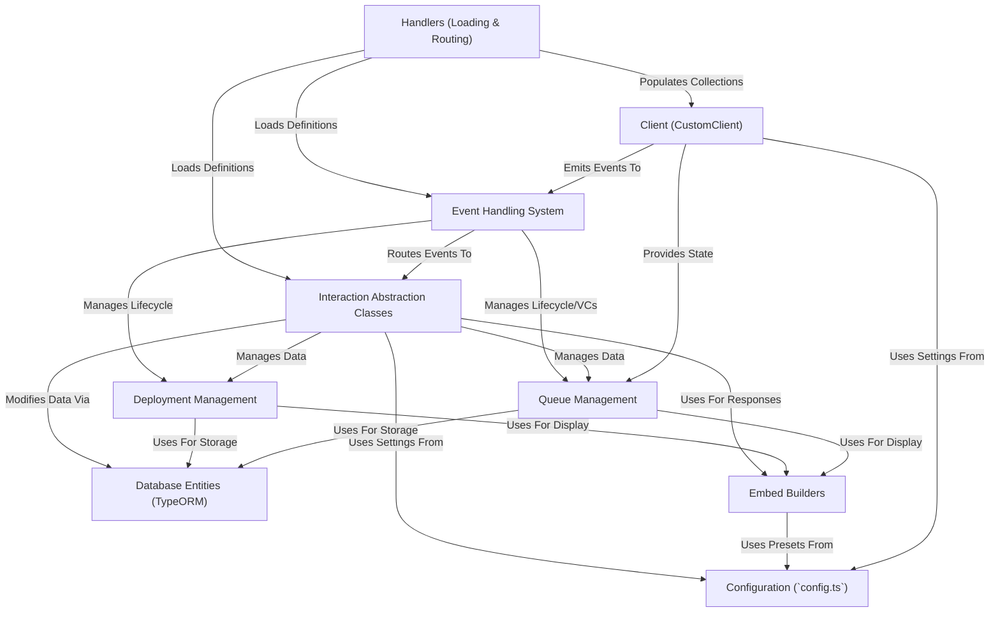

# Tutorial: Deployment-bot

This project is a **Discord bot** designed to help manage game sessions for a community.
It allows users to schedule and sign up for planned events called *Deployments*.
It also features a *Queue System* for organizing players wanting to join spontaneous "Hot Drop" or "Strike" games, automatically forming groups and creating voice channels when ready.
Users interact with the bot primarily through **slash commands** and **buttons**.

**Source Repository:** [https://github.com/CaptainParis/Deployment-bot](https://github.com/CaptainParis/DeploymentBot)

## Chapters

1. [Client (CustomClient)](01_client__customclient_.md)
2. [Event Handling System](02_event_handling_system.md)
3. [Handlers (Loading & Routing)](03_handlers__loading___routing_.md)
4. [Interaction Abstraction Classes](04_interaction_abstraction_classes.md)
5. [Deployment Management](05_deployment_management.md)
6. [Queue Management](06_queue_management.md)
7. [Database Entities (TypeORM)](07_database_entities__typeorm_.md)
8. [Embed Builders](08_embed_builders.md)
9. [Configuration (`config.ts`)](09_configuration___config_ts__.md)

---

